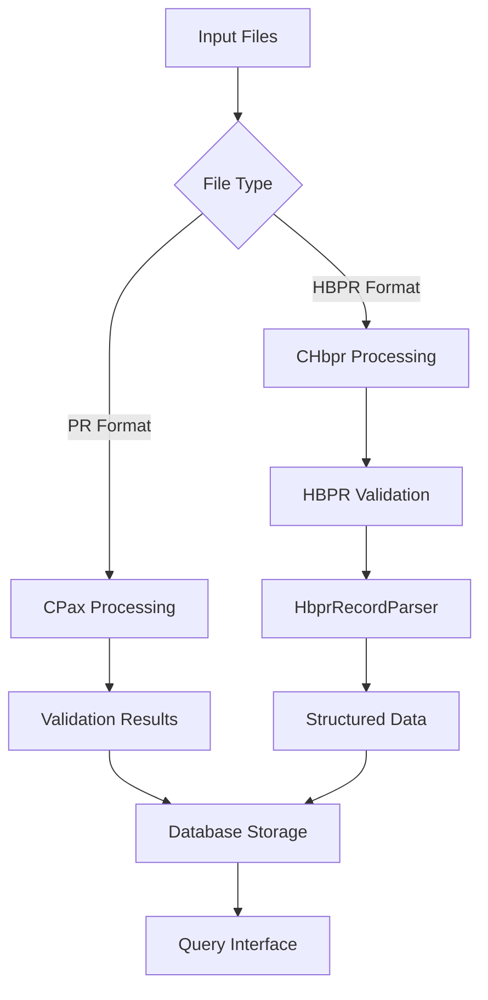

# Flight Data Processing System - Technical Documentation

## Project Overview

The Flight Data Processing System is a comprehensive Python application designed to process and analyze passenger records from two different data formats: PR (Passenger Record) and HBPR (Hotel Booking Passenger Record) formats. The system provides data validation, structured parsing, database storage, and query capabilities.

## System Architecture

### Core Components

```
FlightCheckPy/
├── main_window.py          # Main GUI application entry point
├── obtain_info.py          # PR record processing and validation
├── hbpr_info_processor.py  # HBPR record processing and parsing
├── hbpr_list_processor.py  # HBPR list processing (batch operations)
├── general_func.py         # Utility functions and configuration
├── query_flight_results.py # Database query and reporting
├── run_button.py          # GUI control functions
└── requirements.txt       # Python dependencies
```

## File Structure and Responsibilities

### 1. `obtain_info.py` - PR Record Processing
**Purpose**: Processes PR (Passenger Record) format files for data validation and analysis.

**Key Classes**:
- `CPax`: Main passenger processing class for PR records

**Core Functions**:
- Record parsing and data extraction
- Passenger name validation
- Baggage calculation and verification
- Passport expiration checking
- Error reporting and debugging

### 2. `hbpr_info_processor.py` - HBPR Record Processing
**Purpose**: Advanced HBPR record processing with validation and structured data extraction.

**Key Classes**:
- `CHbpr`: HBPR record validation and processing
- `HbprRecordParser`: Structured data extraction from HBPR records
- `HbprInfoProcessor`: File processing and database operations

**Core Functions**:
- HBPR record validation (similar to PR processing)
- Structured field extraction (30+ data fields)
- Database storage and retrieval
- Parsing quality reporting

### 3. `general_func.py` - Utility Functions
**Purpose**: Centralized configuration and utility functions.

**Key Classes**:
- `CArgs`: System configuration and constants

**Core Functions**:
- Baggage weight calculations
- Class code conversions
- System-wide constants management

### 4. `query_flight_results.py` - Database Operations
**Purpose**: Database querying and reporting functionality.

**Core Functions**:
- Database listing and selection
- Record querying and display
- Cross-database searching
- Report generation

### 5. `hbpr_list_processor.py` - Batch Processing
**Purpose**: Batch processing of HBPR record lists.

**Core Functions**:
- Multi-record file processing
- Missing record identification
- Batch database operations

## Class Relationships and Data Flow

### Processing Workflow



### Class Hierarchy and Dependencies

**1. CHbpr Class (HBPR Validation)**
```python
CHbpr:
├── Dependencies: CArgs (from general_func)
├── Input: Raw HBPR record string
├── Processing:
│   ├── __GetBnAndCls() → Extract boarding number and class
│   ├── __GetChkBag() → Process baggage information
│   ├── __MatchingBag() → Validate baggage allowance
│   ├── __GetPassportExp() → Check passport expiration
│   └── __NameMatch() → Validate passenger names
└── Output: Validation results and error messages
```

**2. HbprRecordParser Class (Structured Extraction)**
```python
HbprRecordParser:
├── Dependencies: SQLite database
├── Input: HBPR record content
├── Processing:
│   ├── parse_record() → Extract 30+ structured fields
│   ├── query_and_parse_all_records() → Batch processing
│   └── store_parsed_results() → Database storage
└── Output: Structured data in hbpr_parsed_records table
```

**3. CArgs Class (Configuration)**
```python
CArgs:
├── InfBagWeight() → Infant baggage weight constant
├── ForeignGoldFlyerBagWeight() → Foreign frequent flyer weight
├── ClassBagWeight() → Class-based baggage weight calculation
└── SubCls2MainCls() → Sub-class to main class conversion
```

## Database Schema

### Core Tables

**1. hbpr_full_records**
```sql
CREATE TABLE hbpr_full_records (
    hbnb_number INTEGER PRIMARY KEY,
    record_content TEXT NOT NULL,
    created_at TIMESTAMP DEFAULT CURRENT_TIMESTAMP
);
```

**2. hbpr_parsed_records** (30+ structured fields)
```sql
CREATE TABLE hbpr_parsed_records (
    hbnb_number INTEGER PRIMARY KEY,
    PNR TEXT,
    NAME TEXT,
    BN TEXT,
    SEAT TEXT,
    EXTRA_SEAT TEXT,
    CLASS TEXT,
    DESTINATION TEXT,
    BAG TEXT,
    BAG_PIECE INTEGER,
    BAG_WEIGHT INTEGER,
    BAG_ALLOWANCE INTEGER,
    FF TEXT,
    TKNE TEXT,
    OTHER_PROPERTIES TEXT,
    MSG TEXT,
    ASVC TEXT,
    PSPT TEXT,
    EXPC TEXT,
    CKIN_EXBG TEXT,
    CKIN_VISA TEXT,
    SEC_TXT TEXT,
    OTHER_CKIN TEXT,
    OTHER_MESSAGES TEXT,
    BAGTAG TEXT,
    VALID_TAG TEXT,
    INVALID_TAG TEXT,
    OPERATE TEXT,
    AGENT_PID TEXT,
    UNKNOWN_CONTENT TEXT,
    parsed_at TIMESTAMP DEFAULT CURRENT_TIMESTAMP
);
```

**3. hbpr_processing_results**
```sql
CREATE TABLE hbpr_processing_results (
    hbnb_number INTEGER,
    boarding_number INTEGER,
    has_error BOOLEAN,
    error_count INTEGER,
    debug_count INTEGER,
    error_messages TEXT,
    debug_messages TEXT,
    processed_at TIMESTAMP DEFAULT CURRENT_TIMESTAMP,
    PRIMARY KEY (hbnb_number)
);
```

## Processing Modes and Usage

### 1. Standard Processing Mode
```bash
python hbpr_info_processor.py
```
- Processes sample HBPR file
- Performs validation using CHbpr class
- Stores validation results in database

### 2. Parsing Mode
```bash
python hbpr_info_processor.py --parse
```
- Reads existing HBPR records from database
- Extracts structured data using HbprRecordParser
- Stores parsed results in hbpr_parsed_records table

### 3. Query Mode
```bash
python query_flight_results.py [options]
```
- Lists available databases
- Queries specific records
- Generates reports

## Data Processing Features

### Validation Capabilities
- **Baggage Verification**: Weight and piece count validation
- **Passport Checking**: Expiration date validation
- **Name Matching**: Passenger name consistency verification
- **Class Validation**: Fare class and upgrade verification

### Structured Data Extraction
- **30+ Data Fields**: Comprehensive data field extraction
- **Regular Expression Parsing**: Advanced pattern matching
- **Known Property Filtering**: Intelligent data categorization
- **Quality Reporting**: Parsing success rate analysis

### Error Handling and Reporting
- **Comprehensive Logging**: Debug and error message tracking
- **Statistical Reporting**: Processing success rates
- **Missing Data Identification**: Gap analysis in record sequences
- **Validation Results**: Pass/fail status for each validation rule

## Configuration and Constants

### Baggage Weight Constants
- Infant baggage weight: 23kg
- Foreign frequent flyer baggage weight: 23kg
- Class-based weight calculations
- Piece count limitations

### System Configuration
- Database file naming conventions
- Error threshold settings
- Debug output levels
- Processing batch sizes

## Development Guidelines

### Code Style Standards
- **Function Spacing**: 2 empty lines between functions, 3 between classes
- **Internal Function Organization**: No empty lines within functions except for Chinese comment separators
- **Type Hints**: Comprehensive type annotation for better code readability
- **Error Handling**: Try-catch patterns for robust error management

### Memory Considerations
- Preference for not automatically updating requirement documents
- Focus on processing efficiency
- Minimal redundant data storage

## API and Integration Points

### Database Integration
- SQLite-based storage system
- Standardized table schemas
- Configurable database file locations
- Transaction-based operations

### File Processing Integration
- Support for multiple input formats
- Configurable encoding handling
- Batch processing capabilities
- Error recovery mechanisms

### Query Interface
- Flexible search capabilities
- Cross-database operations
- Export functionality
- Reporting interfaces

## Performance Characteristics

### Processing Efficiency
- Single-pass file processing
- Optimized regular expression usage
- Batch database operations
- Memory-efficient data structures

### Scalability Features
- Configurable batch sizes
- Database partitioning support
- Parallel processing capabilities (where applicable)
- Resource usage monitoring

## Quality Assurance

### Testing Capabilities
- Sample data processing verification
- Regex pattern validation
- Database integrity checking
- Performance benchmarking

### Monitoring and Reporting
- Processing statistics
- Error rate tracking
- Data quality metrics
- Performance monitoring
