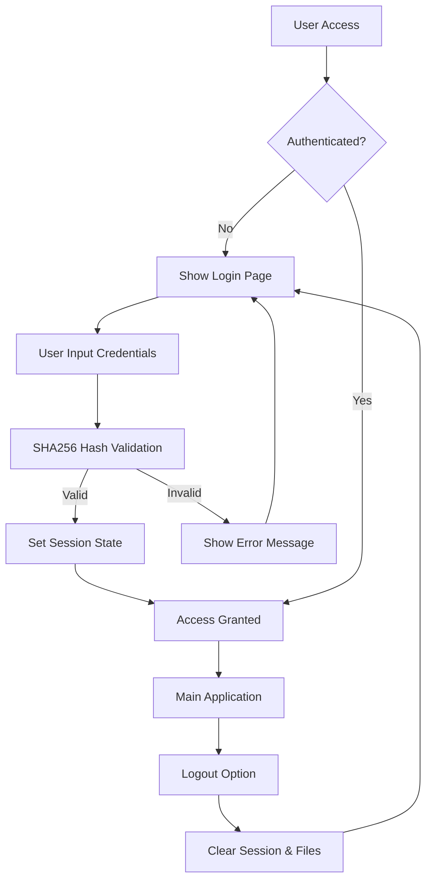
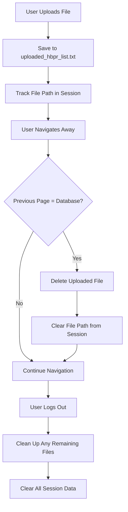
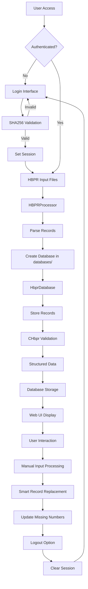

# Flight Data Processing System - Technical Documentation

## Project Overview

The Flight Data Processing System is a comprehensive Python application designed to process and analyze passenger records from HBPR (Hotel Booking Passenger Record) format. The system provides data validation, structured parsing, database storage, and a modern web-based UI for data management and analysis. The application includes a secure authentication system using SHA256 encryption to protect user access.

## 🔐 Security Architecture

### Authentication System
- **SHA256 Encryption**: All user credentials are validated using SHA256 hashing
- **Secure Login Interface**: Professional login page with form validation
- **Session Management**: Secure user session handling with automatic logout capability
- **Access Control**: Restricted access to all system functions requiring authentication

### Security Features
- **Obfuscated Credentials**: No plain text usernames or passwords in source code
- **GitHub Safe**: Code can be safely published to GitHub without exposing sensitive information
- **Hash-Based Validation**: Username and password combinations stored as SHA256 hashes
- **Session Protection**: User sessions are properly managed and cleaned up on logout

### Authentication Flow


### File Management Flow


## System Architecture

### Core Components

```
FlightCheckPy/
├── hbpr_ui.py              # Streamlit web UI for HBPR processing
├── hbpr_info_processor.py  # HBPR record processing and validation
├── hbpr_list_processor.py  # HBPR list processing (batch operations)
├── general_func.py         # Utility functions and configuration
├── run_button.py          # PR record processing (legacy)
├── start_hbpr_ui.bat      # Windows batch file to start UI
├── requirements.txt       # Python dependencies
├── databases/             # Database files directory (new)
└── resources/             # Application resources
    └── fcp0.5.ico        # Application icon
```

## File Structure and Responsibilities

### 1. `hbpr_ui.py` - Web User Interface
**Purpose**: Modern Streamlit-based web interface for HBPR data processing and management.

**Core Functions**:
- `main()`: Main UI function with authentication and navigation
- `authenticate_user()`: SHA256-based user authentication
- `show_login_page()`: Secure login interface
- `show_home_page()`: System overview and statistics
- `show_database_management()`: Database operations interface
- `show_process_records()`: Record processing interface
- `show_view_results()`: Results viewing and analysis
- `show_settings()`: System configuration
- `process_manual_input()`: Advanced manual HBPR input functionality
- `parse_hbnb_input()`: Parse HBNB number ranges and lists
- `validate_full_hbpr_record()`: Multi-layer HBPR record format validation

**Key Features**:
- **Secure Authentication**: SHA256-based login system with session management
- **User Session Control**: Automatic logout and session cleanup
- **Multi-page navigation with sidebar**: Protected navigation requiring authentication
- **Real-time database statistics**: Secure access to system statistics
- **Interactive record processing**: Authenticated record processing interface
- **Missing HBNB number identification**: Secure data analysis features
- **Batch processing capabilities**: Protected batch operations
- **Export and reporting functions**: Secure data export capabilities
- **Manual HBPR input with database selection**: Authenticated manual input interface
- **Flexible HBNB number range input** (e.g., "400-410,412"): Secure input validation
- **Database folder organization** (`databases/` directory): Protected database access
- **Smart record replacement logic**: Secure record management
- **Automatic missing numbers table updates**: Protected data maintenance

### 2. `hbpr_info_processor.py` - HBPR Record Processing
**Purpose**: Advanced HBPR record processing with validation and structured data extraction.

**Key Classes**:
- `CHbpr`: HBPR record validation and processing
- `HbprDatabase`: Database operations and management

**Core Functions**:
- `CHbpr.run()`: Main processing method for HBPR records
- `CHbpr.__GetHbnbNumber()`: Extract HBNB number
- `CHbpr.__GetPassengerInfo()`: Extract passenger information
- `CHbpr.__ExtractStructuredData()`: Extract structured data fields
- `CHbpr.__MatchingBag()`: Validate baggage allowance
- `CHbpr.__GetPassportExp()`: Check passport expiration
- `CHbpr.__NameMatch()`: Validate passenger names
- `HbprDatabase.build_from_hbpr_list()`: Build database from file
- `HbprDatabase.get_validation_stats()`: Get processing statistics
- `HbprDatabase.get_missing_hbnb_numbers()`: Find missing records
- `HbprDatabase.find_database()`: Smart database discovery (prioritizes `databases/` folder)
- `HbprDatabase.create_simple_record()`: Create simple HBPR records
- `HbprDatabase.create_full_record()`: Create full HBPR records
- `HbprDatabase.check_hbnb_exists()`: Check HBNB record existence and type
- `HbprDatabase.delete_simple_record()`: Delete simple records
- `HbprDatabase.validate_flight_info_match()`: Validate flight information consistency
- `HbprDatabase.get_flight_info()`: Get database flight information
- `HbprDatabase.update_missing_numbers_table()`: Recalculate and update missing numbers table
- `HbprDatabase.create_duplicate_record_table()`: Create duplicate_record table
- `HbprDatabase.create_duplicate_record()`: Create duplicate records with original reference
- `HbprDatabase.create_duplicate_record_with_time()`: Create duplicate records with specified timestamp
- `HbprDatabase.get_original_record_info()`: Retrieve original record content and creation timestamp
- `HbprDatabase.auto_backup_before_replace()`: Orchestrate backup process before record replacement
- `HbprDatabase.get_duplicate_records()`: Get all duplicate records for a specific HBNB
- `HbprDatabase.get_all_duplicate_hbnbs()`: Get all HBNBs that have duplicate records
- `HbprDatabase.get_duplicate_record_content()`: Get content of specific duplicate record
- `HbprDatabase.get_combined_records_for_display()`: Get combined records for UI display


### 3. `hbpr_list_processor.py` - Batch Processing
**Purpose**: Batch processing of HBPR record lists and database creation.

**Key Classes**:
- `HBPRProcessor`: HBPR list processing and database management

**Core Functions**:
- `HBPRProcessor.parse_file()`: Parse HBPR text file
- `HBPRProcessor.parse_full_record()`: Parse complete HBPR records (used by UI validation and internal processing)
- `HBPRProcessor._parse_simple_record()`: Parse simple HBPR records
- `HBPRProcessor.find_missing_numbers()`: Identify missing HBNB numbers
- `HBPRProcessor.create_database()`: Create flight-specific databases
- `HBPRProcessor.store_records()`: Store records in database
- `HBPRProcessor.generate_report()`: Generate processing reports

**Features**:
- Database creation automatically saves to `databases/` folder
- Automatic folder creation if `databases/` doesn't exist

### 4. `general_func.py` - Utility Functions
**Purpose**: Centralized configuration and utility functions.

**Key Classes**:
- `CArgs`: System configuration and constants

**Core Functions**:
- `CArgs.SubCls2MainCls()`: Sub-class to main class conversion
- `CArgs.ClassBagWeight()`: Class-based baggage weight calculation
- `CArgs.InfBagWeight()`: Infant baggage weight constant
- `CArgs.ForeignGoldFlyerBagWeight()`: Foreign frequent flyer weight
- `find_a_miss()`: Find missing numbers in sequence

### 5. `run_button.py` - Legacy PR Processing
**Purpose**: Legacy PR (Passenger Record) processing functionality.

**Core Functions**:
- `separate_pr()`: Separate PR records from text file
- `handle_batch()`: Process batch of PR records
- `loop_obtain_info()`: Multi-threaded PR processing

**Note**: This module imports from `obtain_info.py` which appears to be missing from the current project structure.

## Class Relationships and Data Flow

### Authentication and Processing Workflow



### Class Hierarchy and Dependencies

**1. CHbpr Class (HBPR Validation)**
```python
CHbpr:
├── Dependencies: CArgs (from general_func)
├── Input: Raw HBPR record string
├── Processing:
│   ├── __GetHbnbNumber() → Extract HBNB number
│   ├── __GetPassengerInfo() → Extract passenger details
│   ├── __ExtractStructuredData() → Extract 30+ data fields
│   ├── __MatchingBag() → Validate baggage allowance
│   ├── __GetPassportExp() → Check passport expiration
│   └── __NameMatch() → Validate passenger names
└── Output: Validation results and structured data
```

**2. HbprDatabase Class (Database Management)**
```python
HbprDatabase:
├── Dependencies: SQLite database
├── Input: HBPR records and processing results
├── Processing:
│   ├── build_from_hbpr_list() → Create database from file
│   ├── update_with_chbpr_results() → Store validation results
│   ├── get_validation_stats() → Retrieve statistics
│   ├── get_missing_hbnb_numbers() → Find gaps
│   ├── erase_splited_records() → Clean up data
│   ├── find_database() → Smart database discovery (databases/ folder priority)
│   ├── create_simple_record() → Create simple HBPR records
│   ├── create_full_record() → Create full HBPR records
│   ├── check_hbnb_exists() → Check record existence and type
│   ├── delete_simple_record() → Remove simple records
│   ├── validate_flight_info_match() → Validate flight consistency
│   ├── get_flight_info() → Get database flight information
│   ├── update_missing_numbers_table() → Recalculate missing numbers table
│   ├── create_duplicate_record_table() → Create duplicate record table
│   ├── create_duplicate_record() → Create duplicate records
│   ├── get_duplicate_records() → Get duplicates for specific HBNB
│   ├── get_all_duplicate_hbnbs() → Get all HBNBs with duplicates
│   ├── get_duplicate_record_content() → Get specific duplicate content
│   └── get_combined_records_for_display() → Get combined display data

└── Output: Database operations and queries
```

**3. HBPRProcessor Class (Batch Processing)**
```python
HBPRProcessor:
├── Dependencies: File I/O, SQLite
├── Input: HBPR text file
├── Processing:
│   ├── parse_file() → Parse entire file
│   ├── parse_full_record() → Extract complete records
│   ├── _parse_simple_record() → Extract simple records
│   ├── find_missing_numbers() → Identify gaps
│   └── create_database() → Generate database in databases/ folder
└── Output: Flight-specific databases
```

**4. CArgs Class (Configuration)**
```python
CArgs:
├── SubCls2MainCls() → Sub-class to main class conversion
├── ClassBagWeight() → Class-based baggage weight calculation
├── InfBagWeight() → Infant baggage weight constant
└── ForeignGoldFlyerBagWeight() → Foreign frequent flyer weight
```

## Database Schema

### Core Tables

**1. hbpr_full_records**
```sql
CREATE TABLE hbpr_full_records (
    hbnb_number INTEGER PRIMARY KEY,
    record_content TEXT NOT NULL,
    created_at TIMESTAMP DEFAULT CURRENT_TIMESTAMP,
    bol_duplicate BOOLEAN DEFAULT 0,
    -- Additional CHbpr validation fields:
    is_validated BOOLEAN DEFAULT 0,
    is_valid BOOLEAN,
    boarding_number INTEGER,
    pnr TEXT,
    name TEXT,
    seat TEXT,
    class TEXT,
    destination TEXT,
    bag_piece INTEGER,
    bag_weight INTEGER,
    bag_allowance INTEGER,
    ff TEXT,
    pspt_name TEXT,
    pspt_exp_date TEXT,
    ckin_msg TEXT,
    asvc_msg TEXT,
    expc_piece INTEGER,
    expc_weight INTEGER,
    asvc_piece INTEGER,
    fba_piece INTEGER,
    ifba_piece INTEGER,
    flyer_benefit INTEGER,
    is_ca_flyer BOOLEAN,
    inbound_flight TEXT,
    outbound_flight TEXT,
    properties TEXT,
    error_count INTEGER,
    error_baggage TEXT,
    error_passport TEXT,
    error_name TEXT,
    error_visa TEXT,
    error_other TEXT,
    validated_at TIMESTAMP
);
```

**2. hbpr_simple_records**
```sql
CREATE TABLE hbpr_simple_records (
    hbnb_number INTEGER PRIMARY KEY,
    created_at TIMESTAMP DEFAULT CURRENT_TIMESTAMP
);
```

**3. hbpr_processing_results**
```sql
CREATE TABLE hbpr_processing_results (
    hbnb_number INTEGER,
    boarding_number INTEGER,
    has_error BOOLEAN,
    error_count INTEGER,
    debug_count INTEGER,
    error_messages TEXT,
    debug_messages TEXT,
    processed_at TIMESTAMP DEFAULT CURRENT_TIMESTAMP,
    PRIMARY KEY (hbnb_number)
);
```

**4. missing_numbers**
```sql
CREATE TABLE missing_numbers (
    hbnb_number INTEGER PRIMARY KEY
);
```

**5. duplicate_record**
```sql
CREATE TABLE duplicate_record (
    id INTEGER PRIMARY KEY AUTOINCREMENT,
    hbnb_number INTEGER NOT NULL,
    original_hbnb_id INTEGER NOT NULL,
    record_content TEXT NOT NULL,
    created_at TIMESTAMP DEFAULT CURRENT_TIMESTAMP,  -- Can be explicitly set to preserve original timestamps
    FOREIGN KEY (original_hbnb_id) REFERENCES hbpr_full_records(hbnb_number)
);
```

**6. CHbpr Fields (Structured Data)**
```sql
-- Additional fields added to hbpr_full_records
PNR TEXT,
NAME TEXT,
SEAT TEXT,
CLASS TEXT,
DESTINATION TEXT,
BAG_PIECE INTEGER,
BAG_WEIGHT INTEGER,
BAG_ALLOWANCE INTEGER,
FF TEXT,
PSPT_NAME TEXT,
PSPT_EXP_DATE TEXT,
CKIN_MSG TEXT,
EXPC_PIECE INTEGER,
EXPC_WEIGHT INTEGER,
ASVC_PIECE INTEGER,
FBA_PIECE INTEGER,
IFBA_PIECE INTEGER,
FLYER_BENEFIT INTEGER,
IS_CA_FLYER BOOLEAN
```

## Processing Modes and Usage

### 1. Web UI Mode
```bash
streamlit run hbpr_ui.py
```
- **Secure Authentication**: SHA256-based login system
- **Session Management**: Automatic logout and session cleanup
- **Modern web interface** for all operations (requires authentication)
- **Real-time database management** (protected access)
- **Interactive record processing** (authenticated users only)
- **Statistical analysis and reporting** (secure data access)
- **Manual HBPR input** with smart database selection
- **Flexible HBNB number range input**
- **Database folder organization**
- **Duplicate record management** with interactive UI

### 2. Command Line Processing
```bash
python hbpr_info_processor.py
```
- Processes sample HBPR file
- Performs validation using CHbpr class
- Stores validation results in database

### 3. Batch Processing
```bash
python hbpr_list_processor.py
```
- Processes HBPR list files
- Creates flight-specific databases in `databases/` folder
- Identifies missing records
- Generates processing reports

## Data Processing Features

### Validation Capabilities
- **Baggage Verification**: Weight and piece count validation
- **Passport Checking**: Expiration date validation
- **Name Matching**: Passenger name consistency verification
- **Class Validation**: Fare class and upgrade verification
- **HBNB Number Validation**: Record completeness checking
- **Flight Information Validation**: Consistency checking between records and database

### Structured Data Extraction
- **30+ Data Fields**: Comprehensive data field extraction
- **Regular Expression Parsing**: Advanced pattern matching
- **Flight Information**: Flight number and date extraction
- **Quality Reporting**: Parsing success rate analysis

### Error Handling and Reporting
- **Comprehensive Logging**: Debug and error message tracking
- **Statistical Reporting**: Processing success rates
- **Missing Data Identification**: Gap analysis in record sequences
- **Validation Results**: Pass/fail status for each validation rule

### Manual Input Processing
- **Smart Database Discovery**: Prioritizes `databases/` folder, falls back to root
- **Flexible HBNB Input**: Supports single numbers, ranges, and comma-separated lists
- **Record Type Management**: Handles full records, simple records, and replacements
- **Batch Processing**: Efficient creation of multiple simple records
- **Progress Tracking**: Real-time feedback for batch operations
- **Data Integrity**: Automatic missing numbers table updates

## Web UI Features

### Navigation Structure
- **Login**: Secure authentication interface with SHA256 validation
- **Home**: System overview and statistics (authenticated access)
- **Database**: Database operations and maintenance (protected)
- **Process Records**: Record processing, validation, and duplicate management (authenticated)
- **View Results**: Results analysis and export (secure access)
- **Settings**: System configuration (authenticated users)
- **Logout**: Secure session termination and cleanup

### Interactive Features
- **Secure Authentication**: Professional login interface with form validation
- **User Session Display**: Shows logged-in user in sidebar
- **Real-time Statistics**: Live database metrics (authenticated access)
- **Missing Number Analysis**: Gap identification and display (protected)
- **Batch Processing**: Multi-record processing with progress tracking (authenticated)
- **Export Capabilities**: Data export in various formats (secure access)
- **Record Viewing**: Individual record inspection and validation (authenticated)
- **Manual HBPR Input Interface**: Secure manual input with validation
- **Database Selection with Status Indicators**: Protected database operations
- **HBNB Range Input with Validation**: Secure input processing
- **Processing Status and Summary Display**: Authenticated progress tracking
- **Duplicate Record Management**: Create and view duplicate HBPR records
- **Interactive Record Viewer**: Two-column layout for record selection and content display

### Manual HBPR Input Interface
- **Database Selection**: Smart dropdown with flight information display
- **Status Indicators**: Visual feedback for database and record status
- **Input Validation**: Real-time validation of HBNB number formats
- **Processing Feedback**: Detailed progress and result summaries
- **Error Handling**: Comprehensive error messages and recovery options
- **Dual Button System**: "Replace the Record" and "Create a Duplicate Record" options
- **View Type Selection**: Radio buttons to switch between Simple Records and Duplicate Records

### Duplicate Record Management System
- **Purpose**: Manage multiple versions of the same HBNB record for comparison and analysis
- **Database Integration**: Uses dedicated `duplicate_record` table with foreign key references
- **Data Integrity**: Automatically sets `bol_duplicate` flag on original records

#### **Creation Workflow**
1. **Prerequisites**: Original full record must exist in database
2. **Validation**: Same flight information validation as regular records
3. **Storage**: Duplicate stored with reference to original HBNB ID
4. **Flagging**: Original record marked with `bol_duplicate = 1`

#### **User Interface Features**
- **Two-Column Layout**: Left panel for selection, right panel for content display
- **HBNB Selection**: Dropdown showing all HBNBs with duplicate records
- **Interactive DataFrame**: Click-to-select interface with three columns:
  - **Type**: "Original" or "Duplicate"
  - **Record ID**: "original" for originals, numeric ID for duplicates
  - **Created At**: Timestamp or "Original Record"
- **Content Display**: Read-only text area (422px height) showing full HBPR content
- **Visual Feedback**: Different styling for original vs duplicate records
- **Default View**: Shows original record content when no specific selection made

#### **Data Management**
- **Sorting Logic**: Original records appear first, duplicates sorted by creation time
- **Record Relationships**: Maintains parent-child relationship between original and duplicates
- **Content Integrity**: Full HBPR content preserved for each duplicate
- **Statistics Display**: Shows count of duplicates per HBNB

### File Upload and Cleanup System
- **Smart File Tracking**: Uploaded files are tracked in session state for lifecycle management
- **Navigation-Triggered Cleanup**: Files are automatically deleted when users navigate away from the Database Management page
- **Page Transition Detection**: System detects when users switch between pages and triggers cleanup
- **Logout Cleanup**: Complete file cleanup when users log out of the system
- **Error-Resilient Operations**: File deletion operations are protected with exception handling
- **Temporary File Management**: Prevents system clutter by removing temporary uploaded files
- **Session State Management**: Proper tracking and cleanup of file references in user sessions

## Configuration and Constants

### Baggage Weight Constants
- Infant baggage weight: 23kg
- Foreign frequent flyer baggage weight: 23kg
- Class-based weight calculations (F/C: 32kg, Y: 23kg)
- Piece count limitations

### System Configuration
- **Authentication Settings**: SHA256 hash validation for user credentials
- **Session Management**: User session state and authentication status
- **File Management**: Session state tracking for uploaded files and cleanup
- **Database file naming conventions**: Secure database access patterns
- **Error threshold settings**: Protected error handling
- **Debug output levels**: Authenticated debugging capabilities
- **Processing batch sizes**: Secure batch processing limits
- **Database folder organization** (`databases/` directory): Protected database structure
- **HBNB number validation range** (1-99999): Secure input validation

### Session State Variables
- **`current_page`**: Tracks the current active page for navigation
- **`previous_page`**: Stores the previous page for navigation-based cleanup detection
- **`uploaded_file_path`**: Tracks the path of uploaded files for cleanup management
- **`authenticated`**: User authentication status
- **`username`**: Current logged-in user
- **`settings`**: System configuration settings

### Database Organization
- **Default Location**: `databases/` folder in project root
- **Automatic Creation**: Folder created if it doesn't exist
- **Fallback Mechanism**: Searches root directory if `databases/` is empty
- **File Naming**: `{flight_id}.db` format (e.g., `CA123_20231201.db`)

## Development Guidelines

### Code Style Standards
- **Function Spacing**: 2 empty lines between functions, 3 between classes
- **Internal Function Organization**: No empty lines within functions except for Chinese comment separators
- **Type Hints**: Comprehensive type annotation for better code readability
- **Error Handling**: Try-catch patterns for robust error management

### Memory Considerations
- Preference for not automatically updating requirement documents
- Focus on processing efficiency
- Minimal redundant data storage
- **NEW**: Efficient batch processing for multiple record creation
- **File Cleanup**: Automatic removal of temporary uploaded files to prevent disk space accumulation
- **Session State Optimization**: Efficient tracking of file paths without storing file contents in memory

### File Management Best Practices
- **Immediate Cleanup**: Files are deleted as soon as users navigate away from upload functionality
- **Error Handling**: All file operations are wrapped in try-catch blocks to prevent application crashes
- **Session Tracking**: File paths are tracked in session state for proper lifecycle management
- **Logout Cleanup**: Complete cleanup of all temporary files when users log out
- **Path Validation**: File existence is verified before deletion attempts

## API and Integration Points

### Database Integration
- SQLite-based storage system
- Standardized table schemas
- Configurable database file locations
- Transaction-based operations
- Smart database discovery with folder prioritization
- Automatic missing numbers table management

### File Processing Integration
- Support for HBPR format files
- Configurable encoding handling
- Batch processing capabilities
- Error recovery mechanisms
- Flexible HBNB number input parsing
- Database folder organization

### Web UI Integration
- Streamlit-based interface
- Real-time data updates
- Interactive user controls
- Responsive design
- Advanced manual input interface
- Progress tracking and status feedback

## Performance Characteristics

### Processing Efficiency
- Single-pass file processing
- Optimized regular expression usage
- Batch database operations
- Memory-efficient data structures
- Efficient batch simple record creation
- Smart database querying with caching

### Scalability Features
- Configurable batch sizes
- Database partitioning support
- Multi-threaded processing capabilities
- Resource usage monitoring
- Database folder organization for better file management
- Flexible input parsing for large HBNB ranges

## Quality Assurance

### Testing Capabilities
- Sample data processing verification
- Regex pattern validation
- Database integrity checking
- Performance benchmarking
- HBNB input format validation
- Database folder organization testing

### Monitoring and Reporting
- Processing statistics
- Error rate tracking
- Data quality metrics
- Performance monitoring
- Manual input processing statistics
- Missing numbers table accuracy verification

## Missing Components

### Legacy PR Processing
- `obtain_info.py`: Contains CPax class for PR record processing
- This file appears to be missing from the current project structure
- Referenced by `run_button.py` for legacy PR processing functionality

## Current Features

### Manual HBPR Input System
- **Database Selection**: Smart dropdown prioritizing `databases/` folder
- **Input Flexibility**: Support for HBNB ranges and comma-separated lists
- **Record Management**: Intelligent handling of existing records
- **Data Integrity**: Automatic missing numbers table updates
- **User Experience**: Progress tracking and detailed feedback
- **Input Clearing**: Automatic clearing of text input after successful processing
- **Compact Display**: Reduced height for simple records dataframe (200px)

### UI Navigation
- **Simplified Navigation**: Database Management page renamed to "Database"
- **Streamlined Interface**: Cleaner navigation structure
- **Enhanced User Experience**: Improved page transitions and state management

### Database Organization
- **Folder Structure**: Dedicated `databases/` folder for all database files
- **Automatic Creation**: System creates folder if it doesn't exist
- **Fallback Logic**: Searches root directory if `databases/` is empty
- **Consistent Naming**: Standardized database file naming convention

### Error Handling
- **Input Validation**: Comprehensive validation of HBNB number formats
- **Database Operations**: Robust error handling for all database operations
- **User Feedback**: Clear error messages and recovery suggestions
- **Data Consistency**: Automatic maintenance of missing numbers table

### File Management and Cleanup
- **Automatic File Cleanup**: Uploaded files are automatically deleted when navigating away from the Database Management page
- **Session State Tracking**: File paths are tracked in session state for proper cleanup management
- **Navigation-Based Cleanup**: Files are cleaned up when users switch to other pages or tabs
- **Logout Cleanup**: All uploaded files are cleaned up when users log out
- **Error-Safe Cleanup**: File deletion operations are wrapped in try-catch blocks to prevent errors
- **Memory Management**: Prevents accumulation of temporary files in the system
