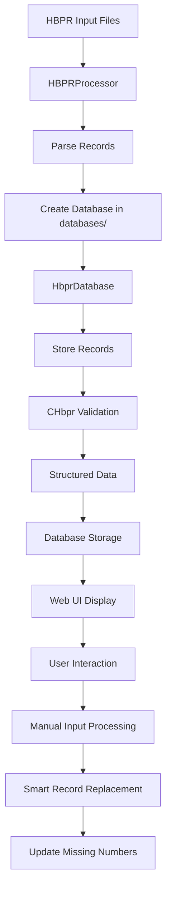

# Flight Data Processing System - Technical Documentation

## Project Overview

The Flight Data Processing System is a comprehensive Python application designed to process and analyze passenger records from HBPR (Hotel Booking Passenger Record) format. The system provides data validation, structured parsing, database storage, and a modern web-based UI for data management and analysis.

## System Architecture

### Core Components

```
FlightCheckPy/
├── hbpr_ui.py              # Streamlit web UI for HBPR processing
├── hbpr_info_processor.py  # HBPR record processing and validation
├── hbpr_list_processor.py  # HBPR list processing (batch operations)
├── general_func.py         # Utility functions and configuration
├── run_button.py          # PR record processing (legacy)
├── start_hbpr_ui.bat      # Windows batch file to start UI
├── requirements.txt       # Python dependencies
├── databases/             # Database files directory (new)
└── resources/             # Application resources
    └── fcp0.5.ico        # Application icon
```

## File Structure and Responsibilities

### 1. `hbpr_ui.py` - Web User Interface
**Purpose**: Modern Streamlit-based web interface for HBPR data processing and management.

**Core Functions**:
- `main()`: Main UI function with navigation
- `show_home_page()`: System overview and statistics
- `show_database_management()`: Database operations interface
- `show_process_records()`: Record processing interface
- `show_view_results()`: Results viewing and analysis
- `show_settings()`: System configuration
- `process_manual_input()`: Advanced manual HBPR input functionality
- `parse_hbnb_input()`: Parse HBNB number ranges and lists

**Key Features**:
- Multi-page navigation with sidebar
- Real-time database statistics
- Interactive record processing
- Missing HBNB number identification
- Batch processing capabilities
- Export and reporting functions
- Manual HBPR input with database selection
- Flexible HBNB number range input (e.g., "400-410,412")
- Database folder organization (`databases/` directory)
- Smart record replacement logic
- Automatic missing numbers table updates

### 2. `hbpr_info_processor.py` - HBPR Record Processing
**Purpose**: Advanced HBPR record processing with validation and structured data extraction.

**Key Classes**:
- `CHbpr`: HBPR record validation and processing
- `HbprDatabase`: Database operations and management

**Core Functions**:
- `CHbpr.run()`: Main processing method for HBPR records
- `CHbpr.__GetHbnbNumber()`: Extract HBNB number
- `CHbpr.__GetPassengerInfo()`: Extract passenger information
- `CHbpr.__ExtractStructuredData()`: Extract structured data fields
- `CHbpr.__MatchingBag()`: Validate baggage allowance
- `CHbpr.__GetPassportExp()`: Check passport expiration
- `CHbpr.__NameMatch()`: Validate passenger names
- `HbprDatabase.build_from_hbpr_list()`: Build database from file
- `HbprDatabase.get_validation_stats()`: Get processing statistics
- `HbprDatabase.get_missing_hbnb_numbers()`: Find missing records
- `HbprDatabase.find_database()`: Smart database discovery (prioritizes `databases/` folder)
- `HbprDatabase.create_simple_record()`: Create simple HBPR records
- `HbprDatabase.create_full_record()`: Create full HBPR records
- `HbprDatabase.check_hbnb_exists()`: Check HBNB record existence and type
- `HbprDatabase.delete_simple_record()`: Delete simple records
- `HbprDatabase.validate_flight_info_match()`: Validate flight information consistency
- `HbprDatabase.get_flight_info()`: Get database flight information
- `HbprDatabase.update_missing_numbers_table()`: Recalculate and update missing numbers table


### 3. `hbpr_list_processor.py` - Batch Processing
**Purpose**: Batch processing of HBPR record lists and database creation.

**Key Classes**:
- `HBPRProcessor`: HBPR list processing and database management

**Core Functions**:
- `HBPRProcessor.parse_file()`: Parse HBPR text file
- `HBPRProcessor._parse_full_record()`: Parse complete HBPR records
- `HBPRProcessor._parse_simple_record()`: Parse simple HBPR records
- `HBPRProcessor.find_missing_numbers()`: Identify missing HBNB numbers
- `HBPRProcessor.create_database()`: Create flight-specific databases
- `HBPRProcessor.store_records()`: Store records in database
- `HBPRProcessor.generate_report()`: Generate processing reports

**Features**:
- Database creation automatically saves to `databases/` folder
- Automatic folder creation if `databases/` doesn't exist

### 4. `general_func.py` - Utility Functions
**Purpose**: Centralized configuration and utility functions.

**Key Classes**:
- `CArgs`: System configuration and constants

**Core Functions**:
- `CArgs.SubCls2MainCls()`: Sub-class to main class conversion
- `CArgs.ClassBagWeight()`: Class-based baggage weight calculation
- `CArgs.InfBagWeight()`: Infant baggage weight constant
- `CArgs.ForeignGoldFlyerBagWeight()`: Foreign frequent flyer weight
- `find_a_miss()`: Find missing numbers in sequence

### 5. `run_button.py` - Legacy PR Processing
**Purpose**: Legacy PR (Passenger Record) processing functionality.

**Core Functions**:
- `separate_pr()`: Separate PR records from text file
- `handle_batch()`: Process batch of PR records
- `loop_obtain_info()`: Multi-threaded PR processing

**Note**: This module imports from `obtain_info.py` which appears to be missing from the current project structure.

## Class Relationships and Data Flow

### Processing Workflow



### Class Hierarchy and Dependencies

**1. CHbpr Class (HBPR Validation)**
```python
CHbpr:
├── Dependencies: CArgs (from general_func)
├── Input: Raw HBPR record string
├── Processing:
│   ├── __GetHbnbNumber() → Extract HBNB number
│   ├── __GetPassengerInfo() → Extract passenger details
│   ├── __ExtractStructuredData() → Extract 30+ data fields
│   ├── __MatchingBag() → Validate baggage allowance
│   ├── __GetPassportExp() → Check passport expiration
│   └── __NameMatch() → Validate passenger names
└── Output: Validation results and structured data
```

**2. HbprDatabase Class (Database Management)**
```python
HbprDatabase:
├── Dependencies: SQLite database
├── Input: HBPR records and processing results
├── Processing:
│   ├── build_from_hbpr_list() → Create database from file
│   ├── update_with_chbpr_results() → Store validation results
│   ├── get_validation_stats() → Retrieve statistics
│   ├── get_missing_hbnb_numbers() → Find gaps
│   ├── erase_splited_records() → Clean up data
│   ├── find_database() → Smart database discovery (databases/ folder priority)
│   ├── create_simple_record() → Create simple HBPR records
│   ├── create_full_record() → Create full HBPR records
│   ├── check_hbnb_exists() → Check record existence and type
│   ├── delete_simple_record() → Remove simple records
│   ├── validate_flight_info_match() → Validate flight consistency
│   ├── get_flight_info() → Get database flight information
│   ├── update_missing_numbers_table() → Recalculate missing numbers table

└── Output: Database operations and queries
```

**3. HBPRProcessor Class (Batch Processing)**
```python
HBPRProcessor:
├── Dependencies: File I/O, SQLite
├── Input: HBPR text file
├── Processing:
│   ├── parse_file() → Parse entire file
│   ├── _parse_full_record() → Extract complete records
│   ├── _parse_simple_record() → Extract simple records
│   ├── find_missing_numbers() → Identify gaps
│   └── create_database() → Generate database in databases/ folder
└── Output: Flight-specific databases
```

**4. CArgs Class (Configuration)**
```python
CArgs:
├── SubCls2MainCls() → Sub-class to main class conversion
├── ClassBagWeight() → Class-based baggage weight calculation
├── InfBagWeight() → Infant baggage weight constant
└── ForeignGoldFlyerBagWeight() → Foreign frequent flyer weight
```

## Database Schema

### Core Tables

**1. hbpr_full_records**
```sql
CREATE TABLE hbpr_full_records (
    hbnb_number INTEGER PRIMARY KEY,
    record_content TEXT NOT NULL,
    created_at TIMESTAMP DEFAULT CURRENT_TIMESTAMP
);
```

**2. hbpr_simple_records**
```sql
CREATE TABLE hbpr_simple_records (
    hbnb_number INTEGER PRIMARY KEY,
    created_at TIMESTAMP DEFAULT CURRENT_TIMESTAMP
);
```

**3. hbpr_processing_results**
```sql
CREATE TABLE hbpr_processing_results (
    hbnb_number INTEGER,
    boarding_number INTEGER,
    has_error BOOLEAN,
    error_count INTEGER,
    debug_count INTEGER,
    error_messages TEXT,
    debug_messages TEXT,
    processed_at TIMESTAMP DEFAULT CURRENT_TIMESTAMP,
    PRIMARY KEY (hbnb_number)
);
```

**4. missing_numbers**
```sql
CREATE TABLE missing_numbers (
    hbnb_number INTEGER PRIMARY KEY
);
```

**5. CHbpr Fields (Structured Data)**
```sql
-- Additional fields added to hbpr_processing_results
PNR TEXT,
NAME TEXT,
SEAT TEXT,
CLASS TEXT,
DESTINATION TEXT,
BAG_PIECE INTEGER,
BAG_WEIGHT INTEGER,
BAG_ALLOWANCE INTEGER,
FF TEXT,
PSPT_NAME TEXT,
PSPT_EXP_DATE TEXT,
CKIN_MSG TEXT,
EXPC_PIECE INTEGER,
EXPC_WEIGHT INTEGER,
ASVC_PIECE INTEGER,
FBA_PIECE INTEGER,
IFBA_PIECE INTEGER,
FLYER_BENEFIT INTEGER,
IS_CA_FLYER BOOLEAN
```

## Processing Modes and Usage

### 1. Web UI Mode
```bash
streamlit run hbpr_ui.py
```
- Modern web interface for all operations
- Real-time database management
- Interactive record processing
- Statistical analysis and reporting
- Manual HBPR input with smart database selection
- Flexible HBNB number range input
- Database folder organization

### 2. Command Line Processing
```bash
python hbpr_info_processor.py
```
- Processes sample HBPR file
- Performs validation using CHbpr class
- Stores validation results in database

### 3. Batch Processing
```bash
python hbpr_list_processor.py
```
- Processes HBPR list files
- Creates flight-specific databases in `databases/` folder
- Identifies missing records
- Generates processing reports

## Data Processing Features

### Validation Capabilities
- **Baggage Verification**: Weight and piece count validation
- **Passport Checking**: Expiration date validation
- **Name Matching**: Passenger name consistency verification
- **Class Validation**: Fare class and upgrade verification
- **HBNB Number Validation**: Record completeness checking
- **Flight Information Validation**: Consistency checking between records and database

### Structured Data Extraction
- **30+ Data Fields**: Comprehensive data field extraction
- **Regular Expression Parsing**: Advanced pattern matching
- **Flight Information**: Flight number and date extraction
- **Quality Reporting**: Parsing success rate analysis

### Error Handling and Reporting
- **Comprehensive Logging**: Debug and error message tracking
- **Statistical Reporting**: Processing success rates
- **Missing Data Identification**: Gap analysis in record sequences
- **Validation Results**: Pass/fail status for each validation rule

### Manual Input Processing
- **Smart Database Discovery**: Prioritizes `databases/` folder, falls back to root
- **Flexible HBNB Input**: Supports single numbers, ranges, and comma-separated lists
- **Record Type Management**: Handles full records, simple records, and replacements
- **Batch Processing**: Efficient creation of multiple simple records
- **Progress Tracking**: Real-time feedback for batch operations
- **Data Integrity**: Automatic missing numbers table updates

## Web UI Features

### Navigation Structure
- **Home**: System overview and statistics
- **Database**: Database operations and maintenance
- **Process Records**: Record processing and validation
- **View Results**: Results analysis and export
- **Settings**: System configuration

### Interactive Features
- **Real-time Statistics**: Live database metrics
- **Missing Number Analysis**: Gap identification and display
- **Batch Processing**: Multi-record processing with progress tracking
- **Export Capabilities**: Data export in various formats
- **Record Viewing**: Individual record inspection and validation
- Manual HBPR Input Interface
- Database Selection with Status Indicators
- HBNB Range Input with Validation
- Processing Status and Summary Display

### Manual HBPR Input Interface
- **Database Selection**: Smart dropdown with flight information display
- **Status Indicators**: Visual feedback for database and record status
- **Input Validation**: Real-time validation of HBNB number formats
- **Processing Feedback**: Detailed progress and result summaries
- **Error Handling**: Comprehensive error messages and recovery options

## Configuration and Constants

### Baggage Weight Constants
- Infant baggage weight: 23kg
- Foreign frequent flyer baggage weight: 23kg
- Class-based weight calculations (F/C: 32kg, Y: 23kg)
- Piece count limitations

### System Configuration
- Database file naming conventions
- Error threshold settings
- Debug output levels
- Processing batch sizes
- Database folder organization (`databases/` directory)
- HBNB number validation range (1-99999)

### Database Organization
- **Default Location**: `databases/` folder in project root
- **Automatic Creation**: Folder created if it doesn't exist
- **Fallback Mechanism**: Searches root directory if `databases/` is empty
- **File Naming**: `{flight_id}.db` format (e.g., `CA123_20231201.db`)

## Development Guidelines

### Code Style Standards
- **Function Spacing**: 2 empty lines between functions, 3 between classes
- **Internal Function Organization**: No empty lines within functions except for Chinese comment separators
- **Type Hints**: Comprehensive type annotation for better code readability
- **Error Handling**: Try-catch patterns for robust error management

### Memory Considerations
- Preference for not automatically updating requirement documents
- Focus on processing efficiency
- Minimal redundant data storage
- **NEW**: Efficient batch processing for multiple record creation

## API and Integration Points

### Database Integration
- SQLite-based storage system
- Standardized table schemas
- Configurable database file locations
- Transaction-based operations
- Smart database discovery with folder prioritization
- Automatic missing numbers table management

### File Processing Integration
- Support for HBPR format files
- Configurable encoding handling
- Batch processing capabilities
- Error recovery mechanisms
- Flexible HBNB number input parsing
- Database folder organization

### Web UI Integration
- Streamlit-based interface
- Real-time data updates
- Interactive user controls
- Responsive design
- Advanced manual input interface
- Progress tracking and status feedback

## Performance Characteristics

### Processing Efficiency
- Single-pass file processing
- Optimized regular expression usage
- Batch database operations
- Memory-efficient data structures
- Efficient batch simple record creation
- Smart database querying with caching

### Scalability Features
- Configurable batch sizes
- Database partitioning support
- Multi-threaded processing capabilities
- Resource usage monitoring
- Database folder organization for better file management
- Flexible input parsing for large HBNB ranges

## Quality Assurance

### Testing Capabilities
- Sample data processing verification
- Regex pattern validation
- Database integrity checking
- Performance benchmarking
- HBNB input format validation
- Database folder organization testing

### Monitoring and Reporting
- Processing statistics
- Error rate tracking
- Data quality metrics
- Performance monitoring
- Manual input processing statistics
- Missing numbers table accuracy verification

## Missing Components

### Legacy PR Processing
- `obtain_info.py`: Contains CPax class for PR record processing
- This file appears to be missing from the current project structure
- Referenced by `run_button.py` for legacy PR processing functionality

## Current Features

### Manual HBPR Input System
- **Database Selection**: Smart dropdown prioritizing `databases/` folder
- **Input Flexibility**: Support for HBNB ranges and comma-separated lists
- **Record Management**: Intelligent handling of existing records
- **Data Integrity**: Automatic missing numbers table updates
- **User Experience**: Progress tracking and detailed feedback
- **Input Clearing**: Automatic clearing of text input after successful processing
- **Compact Display**: Reduced height for simple records dataframe (200px)

### UI Navigation
- **Simplified Navigation**: Database Management page renamed to "Database"
- **Streamlined Interface**: Cleaner navigation structure
- **Enhanced User Experience**: Improved page transitions and state management

### Database Organization
- **Folder Structure**: Dedicated `databases/` folder for all database files
- **Automatic Creation**: System creates folder if it doesn't exist
- **Fallback Logic**: Searches root directory if `databases/` is empty
- **Consistent Naming**: Standardized database file naming convention

### Error Handling
- **Input Validation**: Comprehensive validation of HBNB number formats
- **Database Operations**: Robust error handling for all database operations
- **User Feedback**: Clear error messages and recovery suggestions
- **Data Consistency**: Automatic maintenance of missing numbers table
