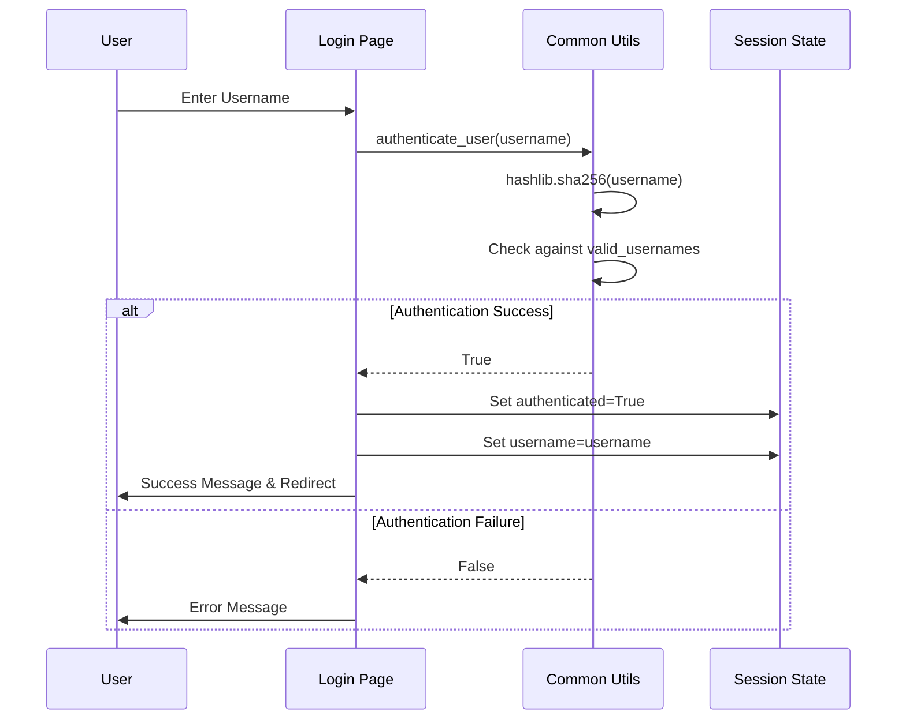
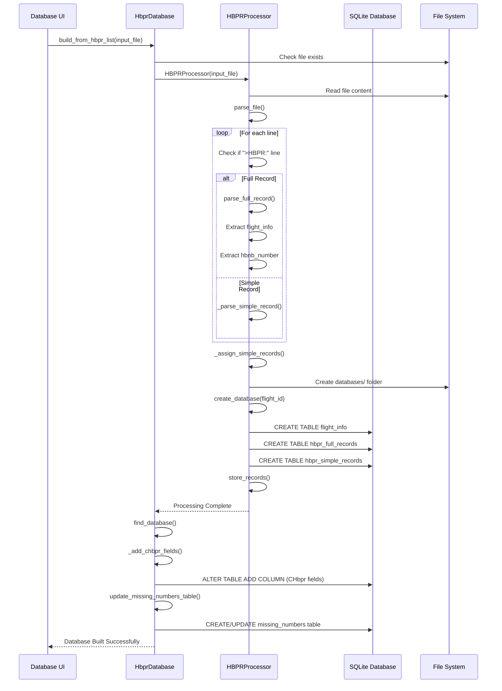
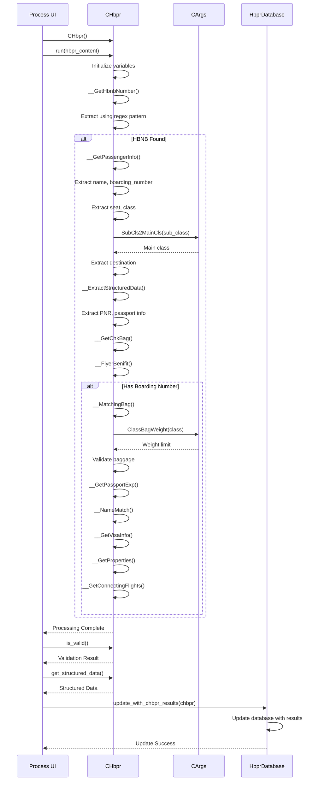
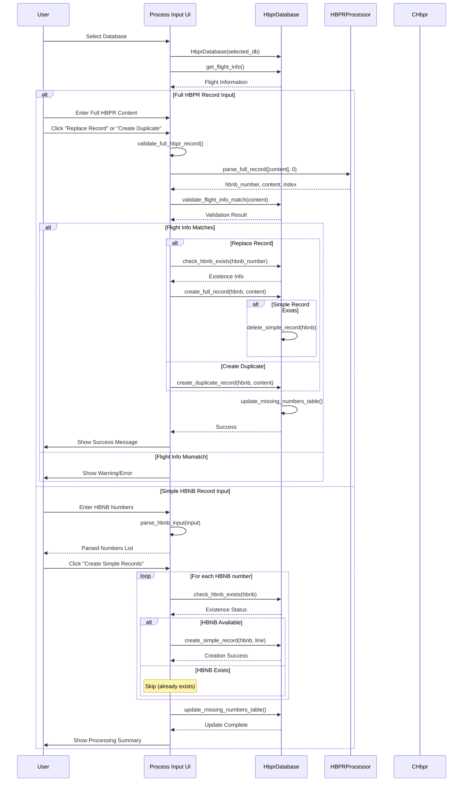
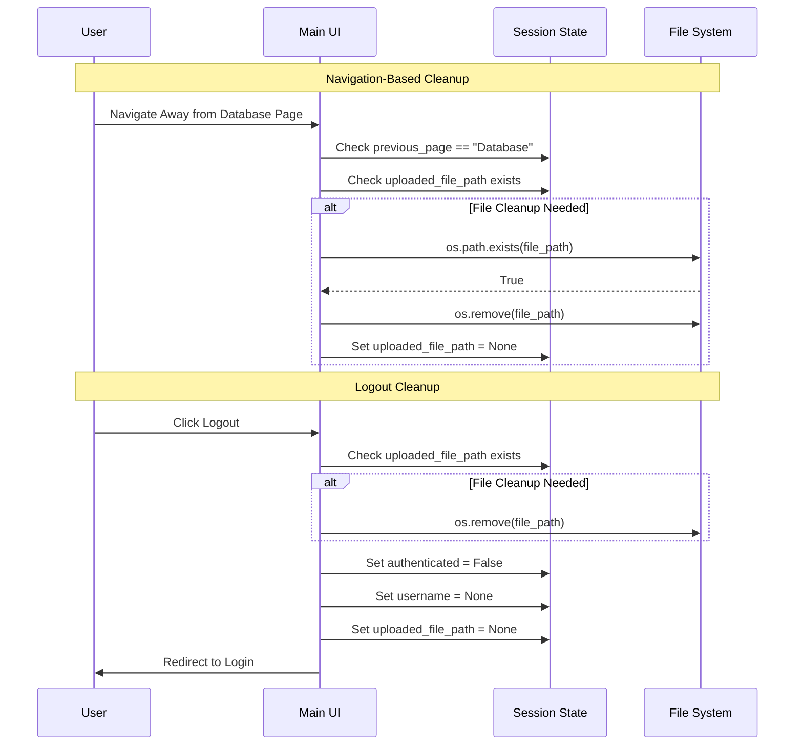
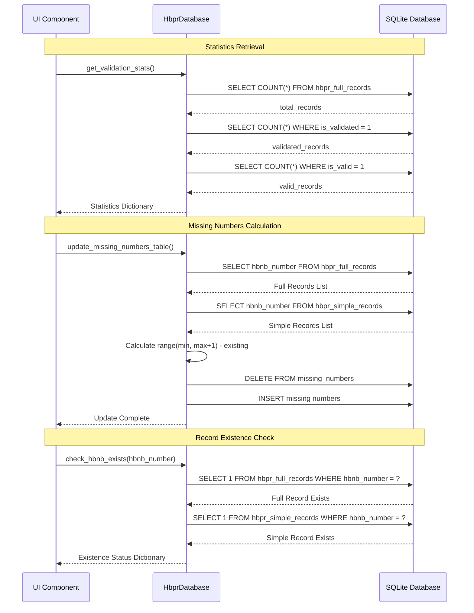
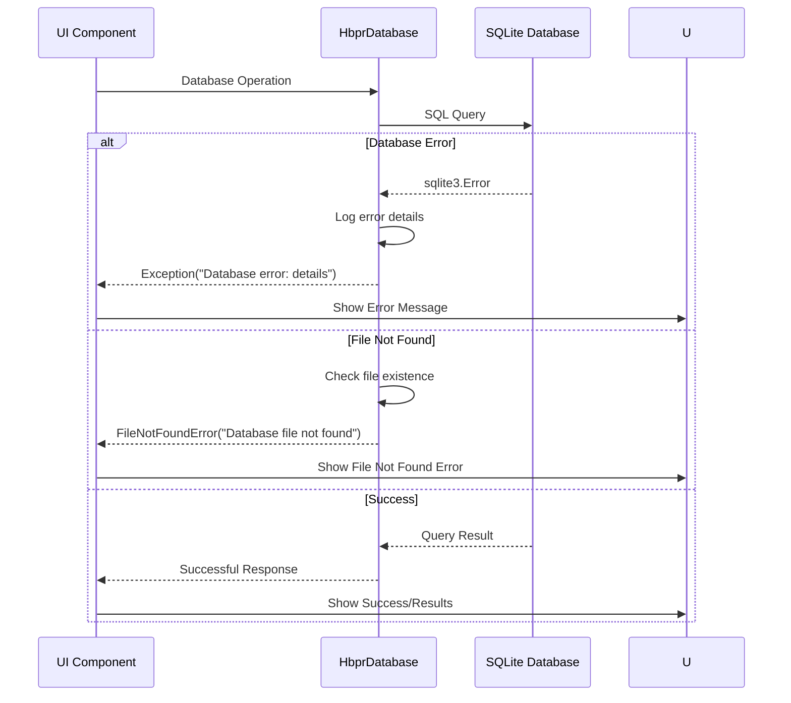
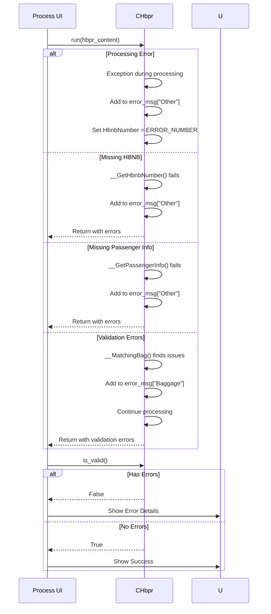

# Flight Data Processing System - Sequence Diagrams

This document contains sequence diagrams illustrating the key workflows and interactions within the HBPR Processing System.

## 1. Complete System Workflow

The main sequence diagram above shows the overall system workflow including authentication, database building, record processing, and manual input.

## 2. Detailed Component Interactions

### Authentication Flow Detail

### Database Building Process Detail

### CHbpr Record Processing Detail

### Manual Input Processing Detail

### File Cleanup Process

### Database Query Operations

## 3. Error Handling Flows

### Database Error Handling

### CHbpr Processing Error Handling

These sequence diagrams provide a comprehensive view of the system's workflows, showing how different components interact during various operations including authentication, database management, record processing, and error handling.