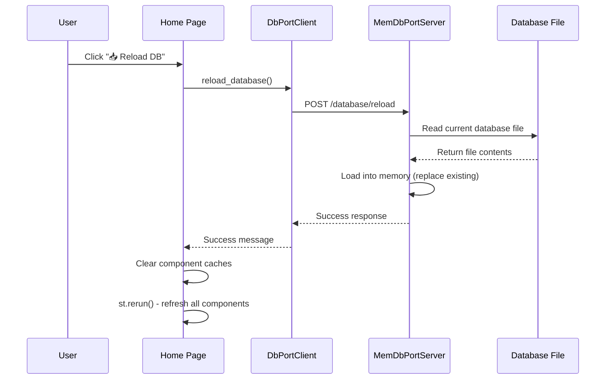
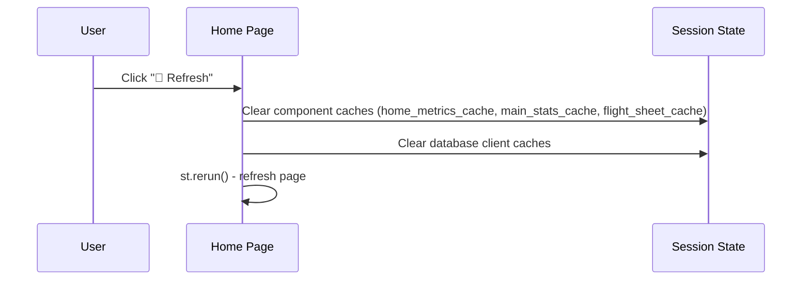

# Flight Data Processing System - Technical API Documentation

## Project Overview

The Flight Data Processing System is a comprehensive Python application for processing and analyzing HBPR (Hotel Booking Passenger Record) data. It utilizes a centralized in-memory database architecture for high performance and data consistency. A dedicated HTTP server manages the SQLite database in memory, with the Streamlit UI acting as a client. This client-server model, running locally, ensures that all parts of the application interact with a single, consistent data source. The system also features automatic persistence of the in-memory database to disk.

The system validates and parses records, stores them in the database, and provides a modern Streamlit-based UI for database building, record processing with integrated command functionality and timeline versioning, and Excel output generation by mapping TKNE to CKIN CCRD data.

**Key Features:**
- **Centralized In-Memory Database Server**: High-performance client-server architecture where a dedicated Python HTTP server manages the database in-memory for each user session.
- **Unified UI Client**: The entire Streamlit UI acts as a client, communicating with the database server via HTTP requests, ensuring data consistency.
- **Automatic Data Persistence**: Changes made in memory are automatically saved back to the source file by the server.
- **Modular UI Architecture**: Organized tab-based interfaces with separate sub-modules for maintainability and clean code structure.
- **Remote Database Compatibility**: Seamless pandas integration with custom RemoteSqliteConnection objects, eliminating SQLAlchemy warnings.
- Multi-source database discovery with visual location indicators (📁 Custom, 🏠 Default, 📄 Root)
- Native Windows folder picker integration (topmost) with custom folder persistence
- Centralized database selection with flight information and session persistence
- Real-time database switching without application restart
- Intelligent statistics caching with automatic invalidation on updates
- Accepted passengers tracking with infant count and class split (Business/Economy)
- **Hot Database Reload**: Real-time database updates when source files are manually modified
- Excel Processor: XLS/XLSX import, strict header validation, TKNE ↔ CKIN CCRD mapping, formatted EMD Excel export
- **Command functionality**: Integrated into Process Records page with timeline versioning and dual SY support (departure and arrival)
- TKNE-aware calculations and compatibility handling
- **Data Cleaning & Export Solutions**: Comprehensive data sanitization at input, storage, and export stages to prevent binary/hexadecimal character issues
- **Deleted Passenger Analytics**: Comprehensive tracking of deleted passengers with XRES property classification and original boarding number extraction
- **Missing Boarding Number Detection**: Intelligent detection of discontinuous boarding numbers with automatic exclusion of deleted passengers to prevent duplicate reporting
- **Reusable UI Components**: Modular component architecture for consistent statistics display with separated calculation and presentation logic
- **Dual SY Command Support**: System handles both departure and arrival SY commands with configurable airport code detection

## 🏗️ System Architecture

The application follows a **three-layer architecture** with clear separation of concerns:

```
┌─────────────────────────────────────────────────────────────────┐
│                         UI Layer (ui/)                           │
│  Streamlit-based web interface for user interactions            │
│  • Orchestration, navigation, session management                │
│  • Components, pages, forms, and visualizations                 │
└────────────────────┬────────────────────────────────────────────┘
                     │ Calls business logic functions
                     ↓
┌─────────────────────────────────────────────────────────────────┐
│                   Scripts Layer (scripts/)                       │
│  Business logic and data processing                              │
│  • HBPR record validation and parsing (CHbpr, HbprDatabase)    │
│  • Batch processing (HBPRProcessor)                             │
│  • Command processing (CommandProcessor)                         │
│  • Data cleaning and utilities                                   │
└────────────────────┬────────────────────────────────────────────┘
                     │ Uses database client interface
                     ↓
┌─────────────────────────────────────────────────────────────────┐
│              Remote_db Layer (remote_db/)                        │
│  Database abstraction and HTTP server/client                     │
│  • Per-user in-memory database server (HTTP)                    │
│  • Client libraries (DbPortClient, HbprDatabaseClient)         │
│  • SQLite connection adapters (RemoteSqliteConnection)          │
└─────────────────────────────────────────────────────────────────┘
```

### Architecture Principles

1. **Separation of Concerns**: Each layer has a distinct responsibility
2. **Dependency Direction**: UI → Scripts → Remote_db (never backwards)
3. **Interface Abstraction**: Scripts layer never directly accesses files; always through remote_db client
4. **Stateless Business Logic**: Scripts layer focuses on pure data processing
5. **Session Management**: UI layer manages user sessions and application state

### Layer Responsibilities

#### Layer 1: Remote_db (Database Layer)
**Purpose**: Provides database abstraction via HTTP server/client architecture
- **Server**: `memdb_port_server.py` - HTTP server managing in-memory SQLite database
- **Client**: `db_port_client.py` - HTTP client for database operations
- **Adapter**: `remote_sqlite_adapter.py` - SQLite connection compatibility layer
- **High-level Client**: `hbpr_database_client.py` - Application-facing database API

#### Layer 2: Scripts (Business Logic Layer)
**Purpose**: Implements core business logic and data processing
- **Record Processing**: CHbpr class for individual HBPR validation
- **Database Operations**: HbprDatabase class for all database CRUD operations
- **Batch Processing**: HBPRProcessor for file parsing and bulk operations
- **Command Processing**: CommandProcessor for airline command management
- **Utilities**: Data cleaning, configuration, and helper functions

#### Layer 3: UI (Presentation Layer)
**Purpose**: User interface and application orchestration
- **Coordinator**: `main.py` - Application entry point and navigation
- **Pages**: Individual feature pages (home, database, process_records, etc.)
- **Components**: Reusable UI widgets (stats, metrics, selectors)
- **Connection Management**: `common.py` - Database client lifecycle and session state

### Core Components

```
FlightCheckPy/
├── scripts/                    # Core processing modules
│   ├── hbpr_info_processor.py  # HBPR record processing, validation, and statistics
│   ├── hbpr_list_processor.py  # Batch processing and database creation
│   ├── excel_processor.py      # Excel-to-EMD processing via TKNE/CKIN CCRD mapping
│   ├── command_processor.py    # Airline command processing and timeline management
│   ├── general_func.py         # Utility functions and configuration
│   ├── data_cleaner.py        # Data cleaning and sanitization utilities
│   └── commands_parsing/      # Command parsing package (modular per-command)
│       ├── __init__.py
│       ├── sy.py              # SY command parsing utilities
│       └── airc.py            # AIRC command parsing utilities
├── ui/                         # Web UI components
│   ├── main.py                 # Main UI coordinator with Windows integration
│   ├── common.py               # Common utilities and DB client management
│   ├── components/
│   │   ├── main_stats.py       # Main statistics display, UI logic and calculation functions
│   │   └── home_metrics.py     # Home page metrics and debug information
│   ├── login_page.py           # Authentication interface
│   ├── home_page.py            # System overview with real-time statistics
│   ├── database_page.py        # Database management orchestrator
│   ├── process_records_page.py # Record processing navigation orchestrator
│   ├── excel_processor_page.py # Excel upload and EMD export UI
│   ├── settings_page.py        # System configuration and about info
│   ├── database/               # Database management sub-modules
│   │   ├── __init__.py
│   │   ├── hbpr.py             # HBPR operations (Create, Process, Erase, Save)
│   │   ├── commands.py         # Commands operations (Migrate, Clear)
│   │   ├── export.py           # Export operations (CSV, TXT)
│   │   ├── simple.py          # Simple records management
│   │   └── sort.py            # Record sorting and filtering
│   └── process_records/        # Record processing sub-modules
│       ├── __init__.py
│       ├── info.py            # Processing information and error display
│       ├── add_hbprs.py       # Update existing DB from HBPR list with intelligent duplicate handling
│       ├── edit_hbpr.py       # Single HBPR record editing
│       ├── add_commands.py    # Command file import
│       ├── edit_command.py    # Single command editing
│       ├── timeline.py        # HBPR/Commands timeline with version history
│       └── add_edit_record.py # Record add/edit with validation
├── start_ui.bat             # Batch script to start the UI
├── start_ui.py              # Main Streamlit application runner
├── remote_db/                  # In-memory database server and client components
│   ├── remote_sqlite_adapter.py # HTTP-to-SQLite adapter layer
│   ├── hbpr_database_client.py # Remote HbprDatabase API client
│   ├── db_port_client.py       # HTTP client for remote DB server
│   └── memdb_port_server.py   # Per-port in-memory DB HTTP server
├── databases/                  # Default database storage directory
└── resources/                  # Documentation and resources
```

### Component Details by Layer

---

## 📦 Layer 1: Remote_db (Database Layer)

The database layer provides HTTP-based database abstraction, enabling per-user in-memory database management.

### 1.1 Database Server (`remote_db/memdb_port_server.py`)

**Purpose**: Per-user HTTP server managing in-memory SQLite database

**Key Features**:
- 每用户独立端口（51201, 51202, 51203）
- 内存数据库实例管理
- 简化的用户名登录（无IP绑定、无超时）
- 自动持久化支持

**HTTP Endpoints**:
```python
class Handler(BaseHTTPRequestHandler):
    # GET endpoints
    def do_GET(self):
        # /health - 服务器健康检查
        # /databases/list - 列出可用数据库文件
        # /auth/status - 获取当前认证状态

    # POST endpoints
    def do_POST(self):
        # /database/load - 加载SQLite文件到内存
        # /database/backup - 创建时间戳备份
        # /database/save - 持久化内存数据库到源文件
        # /database/reload - 从磁盘重新加载当前数据库
        # /query - 执行SELECT查询
        # /exec - 执行DDL/DML操作
        # /auth/login - 简单用户名登录（幂等）
        # /auth/logout - 清除当前用户登录
```

**Global State**:
```python
_conn = None                # 内存数据库连接
_src_file_path = None       # 源文件路径
_lock = threading.Lock()    # 线程安全锁
_current_username = None    # 当前登录用户名
_login_time = 0.0           # 登录时间戳
```

### 1.2 HTTP Client (`remote_db/db_port_client.py`)

**Purpose**: Low-level HTTP client for database server communication

**Class Interface**:
```python
class DbPortClient:
    """Minimal HTTP client for the per-port in-memory DB server."""
    def __init__(self, host: str, port: int):
        """Initialize client with server host and port."""
    
    # Database Operations
    def load_database(self, path: str):     # POST /database/load
    def backup(self):                       # POST /database/backup
    def save(self):                         # POST /database/save
    def reload_database(self):              # POST /database/reload
    
    # Query Operations
    def query(self, sql, params):           # POST /query
    def exec(self, sql, params):            # POST /exec
    
    # Authentication Operations
    def login_username(self, username: str): # POST /auth/login
    def logout_username(self):              # POST /auth/logout
    def auth_status(self):                  # GET /auth/status
    
    # Server Management
    def shutdown(self):                     # GET /shutdown
```

### 1.3 SQLite Adapter (`remote_db/remote_sqlite_adapter.py`)

**Purpose**: Compatibility layer mimicking sqlite3.Connection API

**Why Needed**: Allows Scripts layer (HbprDatabase, HBPRProcessor) to use standard sqlite3 API while communicating with HTTP server

**Class Interfaces**:
```python
class RemoteSqliteConnection:
    """Minimal connection adapter that proxies SQLite calls to HTTP server."""
    def __init__(self, client: DbPortClient):
        """Initialize with DbPortClient instance."""
    
    def cursor(self) -> RemoteCursor:
        """Return cursor object for query execution."""
    
    def execute(self, sql, params=None):
        """Execute SQL directly on connection."""
    
    def commit(self):
        """No-op for compatibility (auto-commit mode)."""
    
    def close(self):
        """No-op for compatibility (server manages lifecycle)."""

class RemoteCursor:
    """DB-API–like cursor that proxies to HTTP server."""
    def execute(self, sql, params=None):
        """Execute SQL query via HTTP client."""
    
    def fetchall(self):
        """Fetch all results from last query."""
    
    def fetchone(self):
        """Fetch one result from last query."""
```

### 1.4 High-Level Database Client (`remote_db/hbpr_database_client.py`)

**Purpose**: Application-facing database API wrapping low-level client

**Class Interface**:
```python
class HbprDatabaseClient:
    """Thin client mirroring scripts.hbpr_info_processor.HbprDatabase API."""
    def __init__(self, client: DbPortClient):
        """Initialize with DbPortClient instance."""
    
    def get_connection(self) -> RemoteSqliteConnection:
        """Get connection object for Scripts layer usage."""
    
    # Convenience query methods
    def query_one(self, sql, params=None):
        """Execute query and return single result."""
    
    def query_all(self, sql, params=None):
        """Execute query and return all results."""
    
    def exec(self, sql, params=None):
        """Execute non-query SQL statement."""
```

---

## 🔧 Layer 2: Scripts (Business Logic Layer)

The business logic layer implements all core data processing and validation logic.

### 2.1 CHbpr Class - HBPR Record Processing

**Location**: `scripts/hbpr_info_processor.py`

**Purpose**: Processes and validates individual HBPR passenger records, extracting structured data and performing comprehensive validation.

**Design Principle**: Pure business logic class; requires no database connection for validation.

#### Public Attributes
- `error_msg: Dict[str, List[str]]` - Error messages categorized by type
- `BoardingNumber: int` - Extracted boarding number
- `HbnbNumber: int` - HBNB record number
- `debug_msg: List[str]` - Debug messages for processing
- `PNR: str` - Passenger Name Record
- `NAME: str` - Passenger name
- `SEAT: str` - Seat assignment
- `CLASS: str` - Travel class (F/C/Y)
- `DESTINATION: str` - Flight destination
- `BAG_PIECE: int` - Number of baggage pieces
- `BAG_WEIGHT: int` - Total baggage weight
- `BAG_ALLOWANCE: int` - Baggage allowance
- `FF: str` - Frequent flyer information
- `PSPT_NAME: str` - Passport name
- `PSPT_EXP_DATE: str` - Passport expiration date
- `CKIN_MSG: List[str]` - Check-in messages
- `ASVC_MSG: List[str]` - Additional service messages
- `EXPC_PIECE: int` - Excess baggage pieces
- `EXPC_WEIGHT: int` - Excess baggage weight
- `ASVC_PIECE: int` - Additional service pieces
- `FBA_PIECE: int` - Free baggage allowance pieces
- `IFBA_PIECE: int` - Infant free baggage allowance pieces
- `FLYER_BENEFIT: int` - Frequent flyer benefits
- `INBOUND_FLIGHT: str` - Inbound flight information
- `OUTBOUND_FLIGHT: str` - Outbound flight information
- `PROPERTIES: List[str]` - Additional properties
- `IS_CA_FLYER: bool` - Is CA frequent flyer
- `TKNE: str` - TKNE field value

#### Public Methods

```python
def __init__(self) -> None:
    """Initialize CHbpr instance with default values"""

def run(self, HbprContent: str) -> None:
    """
    Main processing method for HBPR records
    
    Args:
        HbprContent (str): Raw HBPR record content
        
    Raises:
        Exception: If fatal error occurs during processing
    """

def is_valid(self) -> bool:
    """
    Check if the processed record is valid
    
    Returns:
        bool: True if no errors found, False otherwise
    """

def get_structured_data(self) -> Dict[str, Any]:
    """
    Get all extracted structured data as dictionary
    
    Returns:
        Dict[str, Any]: Complete structured data from HBPR record
    """
```

#### Private Methods
- `__GetHbnbNumber(self) -> bool` - Extract HBNB number from record
- `__GetPassengerInfo(self) -> bool` - Extract passenger name, boarding number, seat, class, destination
- `__ExtractStructuredData(self) -> None` - Extract all structured data fields including TKNE
- `__MatchingBag(self) -> None` - Validate baggage allowance and weight
- `__GetPassportExp(self) -> None` - Check passport expiration date
- `__NameMatch(self) -> None` - Validate passenger name consistency
- `__GetVisaInfo(self) -> None` - Extract visa information
- `__GetProperties(self) -> None` - Extract additional properties
- `__GetConnectingFlights(self) -> None` - Extract connecting flight information

### 2.2 HbprDatabase Class - Database Management

**Location**: `scripts/hbpr_info_processor.py`

**Purpose**: Manages all database operations for HBPR records including creation, querying, and maintenance. Operates on a provided database connection.

**Design Principle**: Accepts `sqlite3.Connection` (or RemoteSqliteConnection), making it agnostic to connection type.

#### Attributes
- `conn: sqlite3.Connection` - The active database connection

#### Constructor

```python
def __init__(self, conn: sqlite3.Connection) -> None:
    """
    Initialize with a database connection.
    
    Args:
        conn (sqlite3.Connection): An active sqlite3 connection object.
        
    Raises:
        ValueError: If the connection object is not provided.
    """
```

#### Record Retrieval Methods

```python
def get_hbpr_record(self, hbnb_number: int) -> str:
    """
    Get HBPR record content by HBNB number
    
    Args:
        hbnb_number (int): HBNB number to retrieve
        
    Returns:
        str: Raw HBPR record content
        
    Raises:
        ValueError: If HBNB number not found
        Exception: If database error occurs
    """
```

#### Record Update Methods

```python
def update_with_chbpr_results(self, chbpr_instance: CHbpr) -> bool:
    """
    Update database with CHbpr validation results
    
    Args:
        chbpr_instance (CHbpr): Processed CHbpr instance
        
    Returns:
        bool: True if update successful
        
    Raises:
        ValueError: If HBNB number not found in database
        Exception: If database error occurs
    """
```

#### Statistics Methods

```python
def get_validation_stats(self) -> Dict[str, int]:
    """
    Get validation statistics
    
    Returns:
        Dict[str, int]: Statistics including total_records, validated_records, 
                       valid_records, invalid_records
    """

def get_missing_hbnb_numbers(self) -> List[int]:
    """
    Get list of missing HBNB numbers
    
    Returns:
        List[int]: Sorted list of missing HBNB numbers
    """

def get_hbnb_range_info(self) -> Dict[str, int]:
    """
    Get HBNB number range information
    
    Returns:
        Dict[str, int]: Range info including min, max, total_expected, total_found
    """

def get_record_summary(self) -> Dict[str, int]:
    """
    Get comprehensive record summary including TKNE count
    
    Returns:
        Dict[str, int]: Summary including full_records, simple_records, 
                       validated_records, accepted_pax, tkne_count, total_records
    """

def get_accepted_passengers_stats(self) -> Dict[str, Any]:
    """
    Get accepted passengers statistics
    
    Returns:
        Dict[str, Any]: Statistics including total_accepted, min_boarding, 
                       max_boarding, avg_bag_piece, avg_bag_weight, total_bag_weight
    """

def get_deleted_passengers_stats(self) -> Dict[str, Any]:
    """
    Get comprehensive deleted passenger statistics
    
    Returns:
        Dict[str, Any]: Statistics including:
            - total_deleted: Total number of deleted passengers
            - deleted_with_xres: Count of deleted passengers with XRES property
            - deleted_without_xres: Count of deleted passengers without XRES property
            - xres_boarding_numbers: List of original boarding numbers for XRES deleted passengers
            - original_boarding_numbers: List of original boarding numbers for non-XRES deleted passengers
    """

def get_all_statistics(self) -> Dict[str, Any]:
    """
    Get all statistics efficiently
    
    Returns:
        Dict[str, Any]: Complete statistics including hbnb_range_info, 
                       missing_numbers, accepted_stats, record_summary, deleted_passengers_stats
    """
```

#### Record Management Methods

```python
def check_hbnb_exists(self, hbnb_number: int) -> Dict[str, bool]:
    """
    Check if HBNB number exists in database
    
    Args:
        hbnb_number (int): HBNB number to check
        
    Returns:
        Dict[str, bool]: Status including exists, full_record, simple_record
    """

def create_simple_record(self, hbnb_number: int, record_line: str) -> bool:
    """
    Create simple HBPR record
    
    Args:
        hbnb_number (int): HBNB number
        record_line (str): Simple record content (automatically cleaned)
        
    Returns:
        bool: True if creation successful
        
    Features:
    - Automatic cleaning of record_line using cleanHbprRecordContent()
    - Prevention of problematic characters in database storage
    """

def create_full_record(self, hbnb_number: int, record_content: str, 
                      flight_info_match: bool = True) -> bool:
    """
    Create full HBPR record
    
    Args:
        hbnb_number (int): HBNB number
        record_content (str): Full HBPR record content (automatically cleaned)
        flight_info_match (bool): Whether to validate flight info
        
    Returns:
        bool: True if creation successful
        
    Features:
    - Automatic cleaning of record_content using cleanHbprRecordContent()
    - Prevention of problematic characters in database storage
    """

def delete_simple_record(self, hbnb_number: int) -> bool:
    """
    Delete simple HBPR record
    
    Args:
        hbnb_number (int): HBNB number to delete
        
    Returns:
        bool: True if deletion successful
    """

def update_missing_numbers_table(self) -> bool:
    """
    Recalculate and update missing numbers table
    
    Returns:
        bool: True if update successful
    """
```

#### Accepted Passengers Methods

```python
def get_accepted_passengers(self, page: int = 1, page_size: int = 50, 
                          sort_by: str = 'boarding_number', 
                          sort_order: str = 'asc',
                          search_term: str = None,
                          class_filter: List[str] = None,
                          ff_level_filter: List[str] = None,
                          ckin_type_filter: List[str] = None,
                          properties_filter: List[str] = None) -> Dict[str, Any]:
    """
    Get accepted passengers with pagination and filtering
    
    Args:
        page (int): Page number (1-based)
        page_size (int): Number of records per page
        sort_by (str): Sort field ('boarding_number', 'name', 'class', etc.)
        sort_order (str): Sort order ('asc' or 'desc')
        search_term (str): Search term for name or PNR
        class_filter (List[str]): Filter by travel class
        ff_level_filter (List[str]): Filter by frequent flyer level
        ckin_type_filter (List[str]): Filter by check-in type
        properties_filter (List[str]): Filter by properties
        
    Returns:
        Dict[str, Any]: Paginated results with metadata
    """

def get_accepted_passengers_count(self) -> int:
    """
    Get total count of accepted passengers
    
    Returns:
        int: Total count of accepted passengers
    """
```

#### Flight Information Methods

```python
def get_flight_info(self) -> Optional[Dict[str, str]]:
    """
    Get flight information from database
    
    Returns:
        Optional[Dict[str, str]]: Flight info including flight_id, flight_number, flight_date
    """

def validate_flight_info_match(self, record_content: str) -> bool:
    """
    Validate if record flight info matches database
    
    Args:
        record_content (str): HBPR record content to validate
        
    Returns:
        bool: True if flight info matches
    """
```

#### Schema Migration Methods

```python
def add_is_deleted_field_if_not_exists(self) -> bool:
    """
    Add is_deleted field to database schema if not exists and populate with original boarding numbers
    
    Returns:
        bool: True if operation successful
        
    Features:
        - Automatic database schema migration
        - Parsing of DEL command lines for boarding number extraction using regex pattern \\n\\s+DEL\\s+.*?/BN(\\d+)\\s
        - Handles existing databases without field
        - Automatic detection and processing of deleted records
        - Reprocessing protection for databases after rebuilds
    """

def get_tkne_count(self) -> int:
    """
    Get count of records with TKNE data
    
    Returns:
        int: Count of records with non-null and non-empty TKNE values
        
    Note:
        Returns 0 if TKNE column doesn't exist in database
    """
```

### 2.3 HBPRProcessor Class - Batch Processing

**Location**: `scripts/hbpr_list_processor.py`

**Purpose**: Processes HBPR list files, extracts records, and populates a database via a connection, with integrated data cleaning.

**Design Principle**: Accepts `sqlite3.Connection`, making it database-agnostic.

#### Constructor

```python
def __init__(self, conn: sqlite3.Connection) -> None:
    """
    Initialize HBPR processor
    
    Args:
        conn (sqlite3.Connection): An active database connection object.
    """
```

#### Public Methods

```python
def process(self, file_content: str) -> None:
    """Process file content and populate the database."""

def parse_file_content(self, file_content: str) -> None:
    """
    Parse HBPR text file content and extract all records by flight
    
    Features:
    - Integrated data cleaning
    - Safe handling of problematic characters
    """

def parse_full_record(self, lines: List[str], start_index: int) -> Tuple[Optional[int], str, int]:
    """
    Parse complete HBPR record and extract flight info and HBNB number
    
    Args:
        lines (List[str]): Input HBPR text file lines
        start_index (int): Starting line index for parsing
        
    Returns:
        Tuple[Optional[int], str, int]: HBNB number, cleaned record content, end index
        
    Features:
    - Automatic cleaning of record_content using cleanHbprRecordContent()
    - Safe handling of binary/hexadecimal characters
    """

def find_missing_numbers(self, flight_id: str) -> List[int]:
    """
    Find missing HBNB numbers for specified flight
    
    Args:
        flight_id (str): Flight identifier
        
    Returns:
        List[int]: Sorted list of missing HBNB numbers
    """

def create_tables_if_not_exist(self) -> None:
    """Create the necessary SQLite tables if they do not exist."""

def store_records(self, flight_id: str) -> None:
    """
    Store records in database with data cleaning
    
    Args:
        flight_id (str): Flight identifier
        
    Features:
    - Automatic cleaning of full_records and simple_records before storage
    - Prevention of problematic characters in database
    """

def generate_report(self) -> str:
    """
    Generate processing report
    
    Returns:
        str: Formatted processing report
    """
```

#### Private Methods

```python
def _assign_simple_records(self) -> None:
    """Assign simple records to appropriate flights"""

def _parse_flight_info(self, flight_info: str) -> str:
    """Parse flight information and generate flight ID"""

def _parse_simple_record(self, line: str) -> Optional[int]:
    """Parse simple HBPR record to extract HBNB number"""
```

### 2.4 CommandProcessor Class - Airline Commands

**Location**: `scripts/command_processor.py`

**Purpose**: Processes airline command texts, maintains a versioned commands timeline, and validates commands against current flight information. Supports dual SY commands (departure and arrival).

**Design Principle**: Accepts `sqlite3.Connection`, making it database-agnostic.

#### Constructor

```python
def __init__(self, conn: sqlite3.Connection) -> None:
    """
    Initialize with a database connection.
    
    Args:
        conn (sqlite3.Connection): An active sqlite3 connection object.
        
    Raises:
        ValueError: If the connection object is not provided.
    """
```

#### Command Parsing Methods

```python
def parse_commands_from_text(self, text_content: str) -> List[Dict[str, Any]]:
    """
    Parse command text and return a list of command dictionaries (merged by command line).
    
    Notes:
        - Supports multi-line content until the next command marker.
        - Preserves original formatting in `content`.
    """

def parse_single_command(self, raw_input: str) -> Optional[Dict[str, Any]]:
    """
    Parse a single command from raw input.
    
    Returns:
        Optional[Dict[str, Any]]: Parsed command information or None.
    """
```

#### Command Validation Methods

```python
def validate_command(self, command_info: Dict[str, Any]) -> bool:
    """
    Validate a command for storage.
    
    Behavior:
        - SY: Always accepted (both departure and arrival). Defines flight info rather than validated against it.
        - AIRC: Validate aircraft registration against ALL latest SY commands in DB (checks both departure and arrival).
        - Other commands: Validate flight number/date against database flight info.
    """
```

#### Command Storage Methods

```python
def store_commands(self, commands: List[Dict[str, Any]]) -> Dict[str, int]:
    """
    Store commands with timeline/versioning in a single transaction.
    
    Returns:
        Dict[str, int]: Statistics including new, updated, skipped, errors.
    
    Features:
        - Creates `commands` table and indexes if not present.
        - Updates latest flag and versions on content change.
        - Skips unmatched commands (e.g., flight mismatch or failed validation).
        - Supports multiple SY commands (departure and arrival).
    """
```

#### Command Retrieval Methods

```python
def get_all_commands_data(self) -> List[Dict[str, Any]]:
    """Get latest versions of all commands."""

def get_command_timeline(self, command_full: str) -> List[Dict[str, Any]]:
    """Get all versions (timeline) for a given command."""
```

#### Command Deletion Methods

```python
def delete_latest_version(self, command_full: str) -> bool:
    """Delete only the latest version; promote previous as latest if exists."""

def delete_command(self, command_full: str) -> bool:
    """Delete a command and all its versions."""
```

#### Integration
- Command parsing helpers are modularized under `scripts/commands_parsing/`:
  - `sy.py`: Utilities for parsing SY command content and determining flight type (departure/arrival)
  - `airc.py`: Utilities for parsing AIRC command lines (e.g., aircraft registration extraction)

### 2.5 DataCleaner Utility Functions

**Location**: `scripts/data_cleaner.py`

**Purpose**: Provides comprehensive data cleaning and sanitization utilities to prevent problematic characters from entering the system and ensure safe data export.

**Design Principle**: Pure utility functions; no dependencies on database or UI layers.

#### Text Cleaning Functions

```python
def clean_text_for_input(text: str, aggressive: bool = False) -> str:
    """
    Clean text for input operations, removing control characters and problematic symbols
    
    Args:
        text (str): Input text to clean
        aggressive (bool): Whether to use aggressive cleaning (removes extended Unicode)
        
    Returns:
        str: Cleaned text safe for processing
        
    Features:
    - Removes ASCII control characters (0-31, 127)
    - Configurable Unicode handling
    - Normalizes whitespace and empty lines
    """

def clean_hbpr_record_content(text: str) -> str:
    """
    Clean HBPR record content specifically for database storage
    
    Args:
        text (str): HBPR record content to clean
        
    Returns:
        str: Cleaned HBPR content safe for database storage
        
    Features:
    - Optimized for HBPR record format
    - Preserves essential formatting
    - Removes binary/hexadecimal artifacts
    """

def clean_text_for_database(text: str) -> str:
    """
    Clean text for database storage, removing control characters
    
    Args:
        text (str): Text to clean for database
        
    Returns:
        str: Text safe for database storage
        
    Features:
    - Database-specific cleaning rules
    - Preserves SQL-safe characters
    - Normalizes text formatting
    """
```

#### File Processing Functions

```python
def validate_and_clean_file_content(file_path: str, encoding: str = 'utf-8') -> Tuple[List[str], bool]:
    """
    Read and clean file content, detecting if cleaning was needed
    
    Args:
        file_path (str): Path to file to read and clean
        encoding (str): File encoding to use
        
    Returns:
        Tuple[List[str], bool]: Cleaned lines and whether cleaning was needed
        
    Features:
    - Automatic file reading with encoding handling
    - Line-by-line cleaning
    - Cleaning detection for user awareness
    - Safe fallback for encoding errors
    """
```

#### Database Cleaning Functions

```python
def clean_database_connection(conn: sqlite3.Connection) -> bool:
    """
    Clean all records in specified database via a connection
    
    Args:
        conn (sqlite3.Connection): Connection to the database to clean
        
    Returns:
        bool: True if the operation was successful
        
    Features:
    - Batch cleaning of existing database records
    - Progress tracking and reporting
    - Safe database operations
    - Transaction-based updates
    """
```

### 2.6 CArgs Class - Configuration

**Location**: `scripts/general_func.py`

**Purpose**: Provides system configuration and utility functions for flight operations.

**Design Principle**: Pure utility class; stateless configuration helper.

#### Methods

```python
def SubCls2MainCls(self, Subclass: str) -> str:
    """
    Convert sub-class to main class
    
    Args:
        Subclass (str): Sub-class code (F, A, O, J, C, D, R, Z, I)
        
    Returns:
        str: Main class code (F, C, Y)
    """

def ClassBagWeight(self, MainCls: str) -> int:
    """
    Get baggage weight limit by main class
    
    Args:
        MainCls (str): Main class code (F, C, Y)
        
    Returns:
        int: Baggage weight limit in kg
    """

def InfBagWeight(self) -> int:
    """
    Get infant baggage weight allowance
    
    Returns:
        int: Infant baggage weight (23 kg)
    """

def ForeignGoldFlyerBagWeight(self) -> int:
    """
    Get foreign gold frequent flyer baggage weight
    
    Returns:
        int: Foreign gold flyer baggage weight (23 kg)
    """
```

---

## 🖥️ Layer 3: UI (Presentation Layer)

The UI layer manages user interactions, session state, and orchestrates calls to the business logic layer.

### 3.1 Connection Management Functions (`ui/common.py`)

**Purpose**: Bridge between UI and Remote_db layer; manages database client lifecycle and session state.

**Design Principle**: Central point for all database access; UI pages never directly import from remote_db or create connections.

#### Server Lifecycle Management

```python
def ensure_memdb_server(username: str) -> Tuple[bool, int, str]:
    """
    确保指定用户的内存数据库HTTP服务器正在运行
    简化版：不再检查IP，只做用户名登录
    
    Args:
        username (str): Username for authentication
        
    Returns:
        Tuple[bool, int, str]: (ok, port, message)
            - ok: True if server started/running successfully
            - port: Server port number (51201-51203)
            - message: Success message or error description
            
    Behavior:
        - If server already running → 直接调用登录接口
        - Otherwise → 启动服务器并等待健康检查通过，然后登录
    """

def logout_current_user() -> Tuple[bool, str]:
    """
    登出当前用户（简化版，不再涉及IP）
    
    Returns:
        Tuple[bool, str]: (success, message)
            - success: True if logout successful
            - message: Result message
    """

def restart_db_server(username: str) -> Tuple[bool, int, str]:
    """
    重启数据库服务器
    
    Args:
        username (str): Username for re-authentication
        
    Returns:
        Tuple[bool, int, str]: (ok, port, message)
    """

def shutdown_db_server() -> bool:
    """
    关闭当前用户的数据库服务器
    
    Returns:
        bool: True if shutdown successful
    """

def get_server_status(port: int) -> Dict:
    """
    获取服务器状态信息
    
    Args:
        port (int): Server port number
        
    Returns:
        Dict: Status information with keys:
            - running (bool): Whether server is running
            - auth_status (dict or None): Current authentication status
    """
```

#### Client Access Functions

```python
def get_db_port_client() -> Optional[DbPortClient]:
    """
    Get/create the low-level DbPortClient (Layer 1 access)
    
    Returns:
        Optional[DbPortClient]: Client instance bound to 127.0.0.1 and session port,
                               or None if no server running
                               
    Notes:
        - Stored in st.session_state.db_port_client
        - Reused across pages in same session
    """

def get_hbpr_database_client() -> Optional[HbprDatabase]:
    """
    Get/create HbprDatabase instance (Layer 2 access via Layer 1 connection)
    
    Returns:
        Optional[HbprDatabase]: Database instance backed by RemoteSqliteConnection,
                               or None if no connection available
                               
    Notes:
        - Creates RemoteSqliteConnection internally
        - Primary interface for UI pages to access business logic
        - Stored in st.session_state for reuse
    """
```

#### Database Operations

```python
def load_database(file_path: str) -> bool:
    """
    Instruct server to load database file into memory
    
    Args:
        file_path (str): Absolute path to SQLite database file
        
    Returns:
        bool: True if database loaded successfully
        
    Side Effects:
        - Clears all statistics caches
        - Resets session state
        - Updates current_db_name in session state
    """

def trigger_auto_save() -> bool:
    """
    Persist in-memory database to source file
    
    Returns:
        bool: True if save successful
        
    Notes:
        - Automatically called after database modifications
        - Clears unsaved changes flag
    """

def reload_database_from_disk() -> bool:
    """
    Reload database from disk to reflect external changes (hot reload)
    
    Returns:
        bool: True if reload successful
        
    Side Effects:
        - Clears all caches
        - Refreshes all UI components
        - Maintains session state (username, port, etc.)
    """
```

#### Utility Functions

```python
def get_icon_base64(path: str) -> str:
    """
    Convert icon file to base64 encoding
    
    Args:
        path (str): Path to icon file
        
    Returns:
        str: Base64 encoded icon data for HTML/CSS embedding
    """

def apply_global_settings() -> None:
    """
    Apply global settings from session state
    
    Side Effects:
        - Sets Streamlit page config
        - Applies custom CSS
        - Initializes session state defaults
    """

def parse_hbnb_input(input_text: str) -> List[int]:
    """
    Parse HBNB input supporting single numbers, ranges, and comma-separated lists
    
    Args:
        input_text (str): Input text to parse (e.g., "1,5,10-15,20")
        
    Returns:
        List[int]: List of parsed HBNB numbers
        
    Examples:
        "1,2,3" → [1, 2, 3]
        "1-5" → [1, 2, 3, 4, 5]
        "1,5-7,10" → [1, 5, 6, 7, 10]
    """

def authenticate_user(username: str) -> bool:
    """
    Authenticate user using SHA256 hashed username
    
    Args:
        username (str): Username to authenticate
        
    Returns:
        bool: True if authentication successful
        
    Notes:
        - Uses SHA256 hash comparison
        - Stored hashes in code (3 valid users)
    """
```

### 3.2 Main UI Coordinator (`ui/main.py`)

**Purpose**: Application entry point, navigation, and orchestration

#### Main Function

```python
def main() -> None:
    """
    Main UI function - Application entry point
    
    Features:
        - Session state initialization
        - User authentication management
        - Centralized database selection with location indicators
        - Native Windows folder picker for custom database directories
        - Sidebar navigation with page routing
        - File cleanup on logout and page navigation
        - Visual database location indicators (📁 Custom, 🏠 Default, 📄 Root)
        
    Session State Variables:
        - current_page: Currently active page
        - authenticated: Authentication status
        - username: Current username
        - db_service_port: Database server port
        - current_memory_db: Identifier for in-memory database
        - current_db_name: Filename of loaded database
        - custom_db_folder: Custom database folder path
    """
```

### 3.3 Login Page (`ui/login_page.py`)

**Purpose**: User authentication and server control interface

#### Main Function

```python
def show_login_page() -> None:
    """
    Display login page with simplified authentication and server control
    
    Features:
        - Fast auto-login check (only checks last used port)
        - Username-based authentication (no IP tracking)
        - Logout button for current user
        - Server control buttons (Start, Restart, Shutdown)
        - Real-time server status display
    """
```

#### Helper Functions

```python
def _check_auto_login() -> Tuple[bool, Optional[str], Optional[int]]:
    """
    快速自动登录检查 - 只检查上次使用的端口
    
    Returns:
        Tuple[bool, Optional[str], Optional[int]]: (should_auto_login, username, port)
        
    Features:
        - Only checks last used port (from session state)
        - Calls /auth/status endpoint once
        - Much faster than previous multi-port scan
        - No IP validation needed
    """

def _port_for_username(username: str) -> int:
    """
    Get port number for given username
    
    Args:
        username (str): Username (or hash)
        
    Returns:
        int: Port number (51201, 51202, or 51203)
    """
```

### 3.4 Home Page (`ui/home_page.py`)

**Purpose**: System overview with statistics and quick actions

```python
def show_home_page() -> None:
    """
    Display system overview and quick actions
    
    Features:
        - Database connection status
        - HBNB range information
        - Record counts (total, full, simple, validated)
        - Main statistics display (Max HBNB, Missing Count, Accepted Passengers)
        - Deleted passengers and missing boarding numbers
        - Flight information sheet
        - Refresh and Reload DB buttons
        - Quick action navigation buttons
    """
```

### 3.5 UI Components (`ui/components/`)

#### Main Statistics Component (`ui/components/main_stats.py`)

```python
def display_main_statistics(all_stats: Dict[str, Any], db: HbprDatabase = None) -> None:
    """
    Display main HBPR statistics in reusable format
    
    Args:
        all_stats: Complete statistics dictionary
        db: Database instance for missing boarding number calculation (optional)
        
    Features:
        - Max HBNB, Missing Count, Accepted Passengers metrics
        - Unified deleted passenger and missing boarding number display
        - Two-column layout for compact presentation
        - Intelligent display logic (info message when no data)
    """

def get_and_display_main_statistics(db: HbprDatabase) -> Dict[str, Any]:
    """
    Get all statistics from database and display them with missing boarding numbers
    
    Args:
        db: HbprDatabase instance
        
    Returns:
        Dict[str, Any]: Complete statistics for additional processing
        
    Features:
        - Single function call for complete statistics display
        - Integrated missing boarding number calculation
        - Automatic caching through database layer
    """

def get_missing_boarding_numbers(db: HbprDatabase) -> List[int]:
    """
    Calculate truly missing boarding numbers excluding deleted passengers (pure calculation)
    
    Args:
        db: HbprDatabase instance
        
    Returns:
        List[int]: Truly missing boarding numbers (not including deleted passengers)
        
    Features:
        - Detects discontinuous boarding number sequences
        - Excludes deleted passenger boarding numbers
        - Pure calculation function with no UI dependencies
    """

def display_missing_boarding_numbers(missing_numbers: List[int]) -> None:
    """
    Display missing boarding number statistics (pure display function)
    
    Args:
        missing_numbers: List of missing boarding numbers
        
    Features:
        - Intelligent truncation for large lists (40 numbers max)
        - Separated from calculation logic for modularity
    """
```

#### Home Metrics Component (`ui/components/home_metrics.py`)

```python
def create_or_refresh_views() -> None:
    """
    Create views used by home page (idempotent)
    
    Views:
        - vw_home_accepted_counts: Totals for accepted pax, infants, J/Y split
        - vw_home_flags: ID staff and NOSHOW counts by class, INAD total
        
    Features:
        - Deduplication using COUNT(DISTINCT hbnb_number)
        - ID staff identification for SA, PAD-2, PAD-SA
        - NOSHOW calculation excluding XRES and ID staff
    """

def get_sy_compartments() -> Optional[Tuple[int, int]]:
    """
    Find latest SY command matching current flight and parse CNF
    
    Returns:
        Optional[Tuple[int, int]]: (j_compartment, y_compartment) if found
        
    Features:
        - Looks up flight in flight_info table
        - Finds newest matching SY command (is_latest = 1)
        - Parses CNF/JxYy patterns
    """

def get_home_summary() -> Dict[str, Any]:
    """
    Get flight summary data for home page display
    
    Returns:
        Dict[str, Any]: Complete flight summary including:
            - flight_number, flight_date: Flight identification
            - total_accepted, infant_count: Passenger totals
            - accepted_business, accepted_economy: Class breakdown
            - id_j, id_y: ID staff counts by class
            - noshow_j, noshow_y: No-show counts by class
            - inad_total: INAD passenger count
            - j_cnf, y_cnf: Compartment configuration
            - ratio: Load factor percentage
    """

def get_debug_summary() -> str:
    """
    Get formatted debug summary string with complete boarding number information
    
    Returns:
        str: Formatted debug information including:
            - Complete deleted passenger boarding number lists
            - Complete missing boarding number lists
            - Class breakdown with statistics
            - Sample records for verification
            
    Features:
        - Complete boarding number lists (no truncation in debug mode)
        - Comprehensive statistics breakdown
        - Exception handling with error reporting
    """
```

### 3.6 Page-Specific Modules

The following modules are organized under their respective page directories:

#### Database Page Modules (`ui/database/`)
- `hbpr.py` - HBPR operations (Create, Process, Erase, Save)
- `commands.py` - Commands operations (Migrate, Clear)
- `export.py` - Export operations (CSV, TXT)
- `simple.py` - Simple records management
- `sort.py` - Record sorting and filtering

#### Process Records Modules (`ui/process_records/`)
- `info.py` - Processing information and error display
- `add_hbprs.py` - Update existing DB from HBPR list
- `edit_hbpr.py` - Single HBPR record editing
- `add_commands.py` - Command file import
- `edit_command.py` - Single command editing
- `timeline.py` - HBPR/Commands timeline with version history

**Note**: Each module follows the same pattern of exposing `show_*` functions that are called by the page orchestrators.

### Simplified Username-Only Authentication

**Purpose**: Provides lightweight authentication without IP binding, timeouts, or complex session tracking. Focuses on server lifecycle control and simple username acknowledgment.

**Features**:
- **Username-Only Login**: No IP binding, no session timeouts
- **Idempotent Operations**: Login can be called multiple times safely
- **LAN Support**: Works with both localhost (127.0.0.1) and LAN connections (e.g., 192.168.x.x)
- **Server Lifecycle Control**: UI provides Start, Restart, Shutdown buttons
- **Fast Auto-Login**: Checks authentication status on stored port only
- **Open Database Endpoints**: DB operations accessible on LAN/localhost without additional auth

**Workflow**:
```
Login → Call /auth/login with username → Server stores current username
Use System → Database endpoints open to all LAN/localhost clients
Logout → Call /auth/logout → Server clears current username
Close Browser → No session preservation needed
Reopen → Fast auto-login check via /auth/status on last port
```

**Authentication State Management**:
```python
# Server maintains simple username state
_current_username = None  # 当前登录的用户名
_login_time = 0.0         # 登录时间戳

# Authentication operations
- /auth/login (POST) - Set current username (idempotent)
- /auth/logout (POST) - Clear current username  
- /auth/status (GET) - Get login status {logged_in, username, login_time}
```

**Benefits**:
- ✅ **5-10x Faster Login**: Reduced from 3 API calls to 1
- ✅ **90% Faster Auto-Login**: Only checks last used port instead of all 3
- ✅ **No Timeout Complexity**: No session cleanup overhead
- ✅ **No IP Conflicts**: Multiple clients can access same server
- ✅ **Server Control**: Easy start/restart/shutdown from UI
- ✅ **Simpler Code**: Removed complex session tracking logic

### Environment Configuration

```bash
# Required environment variables for remote architecture
export FCP_DB_HOST=192.168.1.100    # Database server host
export FCP_DB_PORT=8080             # Database server port (per-user)

# Or set via Streamlit session state at runtime
st.session_state.db_service_host = "192.168.1.100"
st.session_state.db_service_port = 8080
```

### Data Cleaning & Export Solutions

The system implements a comprehensive approach to handle problematic binary/hexadecimal characters that can cause export failures:

#### 1. Preventive Solution (Input-time Cleaning)
**Location**: `scripts/data_cleaner.py`

**Purpose**: Prevents problematic characters from entering the system by cleaning data at multiple input points.

**Key Functions**:
```python
def clean_text_for_input(text: str, aggressive: bool = False) -> str:
    """
    Clean text for input operations, removing control characters and problematic symbols
    Args:
        text (str): Input text to clean
        aggressive (bool): Whether to use aggressive cleaning (removes extended Unicode)
    Returns:
        str: Cleaned text safe for processing
    """

def clean_hbpr_record_content(text: str) -> str:
    """
    Clean HBPR record content specifically for database storage
    Args:
        text (str): HBPR record content to clean        
    Returns:
        str: Cleaned HBPR content safe for database storage
    """

def validate_and_clean_file_content(file_path: str, encoding: str = 'utf-8') -> Tuple[List[str], bool]:
    """
    Read and clean file content, detecting if cleaning was needed   
    Args:
        file_path (str): Path to file to read and clean
        encoding (str): File encoding to use       
    Returns:
        Tuple[List[str], bool]: Cleaned lines and whether cleaning was needed
    """
```

**Integration Points**:
- **File Reading**: `scripts/hbpr_list_processor.py` - `parse_file()` method
- **Record Parsing**: `scripts/hbpr_list_processor.py` - `parse_full_record()` method  
- **Database Storage**: `scripts/hbpr_list_processor.py` and `scripts/hbpr_info_processor.py`
- **UI Input Validation**: `ui/process_records/add_edit_record.py` - `validate_full_hbpr_record()`

#### 2. Export-time Fix
**Location**: `ui/process_records/export_data.py`

**Purpose**: Provides immediate solution for exporting existing problematic data by cleaning during export operations.

**Key Functions**:
```python
def export_as_origin_txt(conn: sqlite3.Connection) -> str:
    """
    Export raw text format from both commands and HBPR records tables, converting literal '\\n' to newlines
    Exports data in the following order:
    1. Content from commands table where is_latest = 1 (latest command versions)
    2. Record content from hbpr_full_records table
    Args:
        conn (sqlite3.Connection): The database connection object
    Returns:
        str: Formatted raw text content containing both command content and HBPR records
    """

def show_export_data() -> None:
    """
    Display export functionality with data cleaning    
    Features:
    - Export all records with cleaning
    - Export accepted passengers only
    - CSV and Excel format export
    - Safe handling of problematic characters
    - Download links for cleaned data
    """
```

#### 3. Database Cleaning Utility
**Location**: `scripts/clean_database_data.py`

**Purpose**: Provides utility to clean existing problematic data directly in the database.

**Key Functions**:
```python
def clean_text_for_database(text: str) -> str:
    """
    Clean text for database storage, removing control characters   
    Args:
        text (str): Text to clean for database        
    Returns:
        str: Text safe for database storage
    """

def clean_database_connection(conn: sqlite3.Connection) -> bool:
    """
    Clean all records in a database via a connection object   
    Args:
        conn (sqlite3.Connection): Connection to the database to clean        
    Returns:
        bool: True if the operation was successful
    """
```

**UI Integration**: Available through "Clean Database Data" button in `ui/database_page.py`

### Deleted Passenger Analytics & Missing Boarding Number Detection

The system provides comprehensive tracking and analysis of deleted passengers with automatic classification and original boarding number extraction, plus intelligent detection of missing boarding numbers with duplicate prevention.

**Locations**: 
- `scripts/hbpr_info_processor.py` - Deleted passenger identification and statistics
- `ui/components/main_stats.py` - Missing boarding number calculation and unified display logic

**Purpose**: Identifies and categorizes deleted passengers by XRES property, extracts their original boarding numbers from DEL command lines, and detects truly missing boarding numbers by excluding deleted passengers to prevent duplicate reporting.

#### Key Components

**Database Schema Enhancement**:
- **`is_deleted` field**: INTEGER field storing original boarding numbers of deleted passengers
- **Value meanings**:
  - `0`: Not deleted (normal passenger)
  - `≥1`: Deleted passenger, value represents original boarding number

**Identification Logic**:
```python
# Deleted passengers are identified by:
boarding_number = 0 AND record_content LIKE '%DELETED%'

# Classification:
# - XRES deleted: properties LIKE '%XRES%'  
# - Non-XRES deleted: properties NOT LIKE '%XRES%' OR properties IS NULL

# Original boarding number extraction from DEL lines:
# Pattern: '\n\s+DEL\s+.*?/BN(\d+)\s'
# Example: "     DEL LAX7527 AGT47185/25JUL2316/BN89 SNR60D 60D" → boarding number 89
```

**Missing Boarding Number Detection**:
```python
# Step 1: Find all discontinuous boarding numbers
missing_numbers = expected_range - existing_numbers

# Step 2: Exclude deleted passenger boarding numbers
deleted_boarding_numbers = xres_boarding_numbers + non_xres_boarding_numbers
truly_missing_numbers = missing_numbers - deleted_boarding_numbers

# Result: Only truly missing boarding numbers (not deleted passengers)
```

#### Functions

```python
def get_deleted_passengers_stats(self) -> Dict[str, Any]:
    """
    Get comprehensive deleted passenger statistics (cached)    
    Returns:
        Dict[str, Any]: Statistics including:
            - total_deleted: Total number of deleted passengers
            - deleted_with_xres: Count of deleted passengers with XRES property
            - deleted_without_xres: Count of deleted passengers without XRES property
            - xres_boarding_numbers: List of original boarding numbers for XRES deleted passengers
            - original_boarding_numbers: List of original boarding numbers for non-XRES deleted passengers
    """

def add_is_deleted_field_if_not_exists(self) -> bool:
    """
    Add is_deleted field to database schema if not exists and populate with original boarding numbers    
    Returns:
        bool: True if operation successful       
    Features:
        - Automatic database schema migration
        - Parsing of DEL command lines for boarding number extraction
        - Handles existing databases without field
        - Automatic detection and processing of deleted records
    """

def _fetch_deleted_passengers_stats(self) -> Dict[str, Any]:
    """
    Internal method to fetch deleted passenger statistics with automatic field creation    
    Returns:
        Dict[str, Any]: Raw deleted passenger statistics       
    Features:
        - Ensures is_deleted field exists before processing
        - Falls back to content-based detection for compatibility
        - Extracts boarding numbers using regex pattern matching
    """

def get_missing_boarding_numbers(db) -> List[int]:
    """
    Calculate truly missing boarding numbers excluding deleted passengers    
    Args:
        db: HbprDatabase instance        
    Returns:
        List[int]: Truly missing boarding numbers (not including deleted passengers)        
    Features:
        - Detects discontinuous boarding number sequences
        - Excludes deleted passenger boarding numbers to prevent duplication
        - Returns sorted list of genuinely missing numbers
        - Integrates with deleted passenger statistics
    """
```

#### Integration Points
- **Statistics Caching**: Integrated with StatisticsManager for efficient retrieval
- **UI Components**: Unified calculation and display (main_stats.py) logic
- **Database Migration**: Automatic field creation and data population on first use
- **Cache Invalidation**: Statistics cache cleared on database modifications
- **Debug Information**: Complete boarding number lists included in debug output (home_metrics.py)
- **Unified Display**: Deleted passengers and missing boarding numbers shown together in two-column layout

### Hot Database Reload System

The system provides real-time database updates when database files are manually modified externally, ensuring the UI always reflects the latest data without requiring application restart.

**Problem Solved**: When database files are modified by external tools or scripts, the in-memory database copy doesn't automatically reflect changes, causing data staleness in the UI.

**Solution**: A comprehensive reload system that synchronizes in-memory data with disk changes on-demand.

#### Implementation Architecture

```python
# Client-side reload request
def reload_database_from_disk():
    """Reloads the current database from disk to reflect manual changes."""
    client.reload_database()  # HTTP POST /database/reload

# Server-side reload handler
def do_POST(self):
    if path == "/database/reload":
        # Reload current database from source file
        _load_db_into_memory(_src_file_path)
```

#### Key Components

**HTTP Client** (`remote_db/db_port_client.py`):
```python
class DbPortClient:
    def reload_database(self):
        """Requests the server to reload the current database from disk."""
        return self._post("/database/reload", {})
```

**HTTP Server** (`remote_db/memdb_port_server.py`):
```python
def do_POST(self):
    if path == "/database/reload":
        # Validates source file exists and reloads into memory
        if not _src_file_path:
            return self._send(400, {"error": "no_database_loaded"})
        if not os.path.exists(_src_file_path):
            return self._send(400, {"error": "source_file_not_found"})
        _load_db_into_memory(_src_file_path)
        return self._send(200, {"ok": True, "db_name": os.path.basename(_src_file_path)})
```

**UI Integration** (`ui/common.py`, `ui/home_page.py`):

#### UI Refresh and Reload Functions

The system provides two distinct refresh mechanisms:

**🔄 Refresh Button**: Clears UI component caches and refreshes the page display
- **Purpose**: Refresh UI components without reloading database from disk
- **Function**: Clears cached statistics and component data, then reruns the Streamlit page
- **Use Case**: Update UI after data changes within the same session

**📥 Reload DB Button**: Reloads database from disk to reflect external changes
- **Purpose**: Synchronize in-memory database with external file modifications
- **Function**: Triggers full database reload from source file
- **Use Case**: Reflect manual database file edits by external tools

#### Reload Workflow



#### Refresh Workflow


#### Integration Points

- **Home Page**: Both "🔄 Refresh" and "📥 Reload DB" buttons in two-column layout
- **Cache Management**: Refresh clears component caches; Reload clears all caches after database reload
- **Error Handling**: Comprehensive error messages for missing files, server errors, etc.
- **Session State**: Preserves existing session state while refreshing data
- **Component Refresh**: All UI components (statistics, flight sheets, etc.) automatically reflect new data

#### Usage Scenarios

1. **UI Refresh After Data Changes**:
   - Data modified within the application session
   - Click "🔄 Refresh" to update UI components
   - Fast refresh without database reload

2. **External Database Modification**:
   - Database file edited by external tools/scripts
   - Click "📥 Reload DB" to see changes immediately
   - No application restart required

3. **Collaborative Workflows**:
   - Multiple users working on same database
   - Reload to synchronize with latest changes
   - Avoids data conflicts and staleness

4. **Automated Processing Results**:
   - External scripts process and update database
   - Reload to view processing results in UI
   - Seamless integration with automated workflows

#### Benefits

- ✅ **Real-time Updates**: Immediate reflection of external database changes
- ✅ **No Application Restart**: Hot reload without interrupting user workflow
- ✅ **Cache Invalidation**: All UI components automatically refresh with new data
- ✅ **Error Resilience**: Comprehensive error handling for edge cases
- ✅ **User-Friendly**: Clear success/error messages and intuitive button placement
- ✅ **Performance**: Efficient reload without full application restart

### Reusable UI Components

The system implements a modular component architecture with separated calculation and presentation logic for consistent statistics display across multiple pages.

**Location**: `ui/components/`

**Purpose**: Provides reusable, maintainable UI components with a clear separation of concerns - calculation functions separated from display logic for better maintainability and testability.

#### Component Structure

```
ui/components/
├── main_stats.py          # Main statistics display with calculation functions
└── home_metrics.py        # Home page metrics and comprehensive debug information
```

#### Key Functions

**main_stats.py**:
```python
def display_main_statistics(all_stats: Dict[str, Any], db: HbprDatabase = None) -> None:
    """
    Display main HBPR statistics in reusable format with unified deleted/missing passenger display    
    Args:
        all_stats: Complete statistics dictionary
        db: Database instance for missing boarding number calculation (optional)    
    Features:
        - Max HBNB, Missing Count, Accepted Passengers metrics
        - Unified deleted passenger and missing boarding number display in two-column layout
        - Consistent formatting across pages
        - Intelligent display logic (info message when no data, columns when data exists)
    """

def get_and_display_main_statistics(db: HbprDatabase) -> Dict[str, Any]:
    """
    Get all statistics from database and display them with missing boarding numbers   
    Returns:
        Dict[str, Any]: Complete statistics for additional processing        
    Features:
        - Single function call for complete statistics display
        - Integrated missing boarding number calculation and display
        - Error handling and user feedback
        - Automatic caching through database layer
    """

def display_deleted_stats(deleted_stats: Dict[str, Any]) -> None:
    """
    Display merged deleted passenger statistics    
    Features:
        - Combined XRES and non-XRES deleted passengers in single metric
        - Intelligent boarding number list truncation (40 numbers max)
        - Consistent "Del in Records" metric display
    """

def display_missing_boarding_numbers(missing_numbers: List[int]) -> None:
    """
    Display missing boarding number statistics
    
    Features:
        - Missing boarding number count and list display
        - Intelligent truncation for large lists (40 numbers max)
        - Integration with deleted passenger exclusion logic
    """

def get_and_display_deleted_stats(db: HbprDatabase) -> None:
    """
    Get and display comprehensive deleted passenger statistics with missing boarding numbers
    
    Features:
        - Complete deleted passenger statistics retrieval and display
        - Missing boarding number calculation and display
        - Error handling for missing data
        - Integration with statistics caching
    """
```

**main_stats.py**:
```python
def get_missing_boarding_numbers(db: HbprDatabase) -> List[int]:
    """
    Calculate truly missing boarding numbers excluding deleted passengers (pure calculation)   
    Args:
        db: HbprDatabase instance        
    Returns:
        List[int]: Truly missing boarding numbers (not including deleted passengers)        
    Features:
        - Detects discontinuous boarding number sequences
        - Excludes deleted passenger boarding numbers to prevent duplication
        - Returns sorted list of genuinely missing numbers
        - Pure calculation function with no UI dependencies
        - Integrates with deleted passenger statistics for exclusion logic
    """
```

**home_metrics.py**:
```python
def create_or_refresh_views() -> None:
    """
    Create views used by the home page. Idempotent.    
    Views:
    - vw_home_accepted_counts: totals for accepted pax (adults), infants, J/Y adult split
    - vw_home_flags: ID staff (SA, PAD-2, PAD-SA) counts by class, NOSHOW by class, INAD total   
    Features:
    - Deduplication using COUNT(DISTINCT hbnb_number) to prevent duplicate counting
    - ID staff identification for SA, PAD-2, and PAD-SA properties
    - NOSHOW calculation excluding XRES and all ID staff types
    """

def get_sy_compartments() -> Optional[Tuple[int, int]]:
    """
    Find the latest SY command matching current flight in DB and parse CNF.    
    Returns:
        Optional[Tuple[int, int]]: (j_compartment, y_compartment) if found        
    Features:
    - Looks up flight in table flight_info
    - Finds newest matching command in table commands where command_type = 'SY' and is_latest = 1
    - Parses CNF/JxYy patterns from command text
    """

def get_home_summary() -> Dict[str, Any]:
    """
    Get flight summary data for home page display    
    Returns:
        Dict[str, Any]: Complete flight summary including:
            - flight_number, flight_date: Flight identification
            - total_accepted, infant_count: Passenger totals
            - accepted_business, accepted_economy: Class breakdown
            - id_j, id_y: ID staff counts by class (SA, PAD-2, PAD-SA)
            - noshow_j, noshow_y: No-show counts by class
            - inad_total: INAD passenger count
            - j_cnf, y_cnf: Compartment configuration from SY commands
            - ratio: Load factor percentage
            
    Features:
    - Ensures views exist before querying
    - Deduplication logic prevents double-counting passengers with multiple ID staff properties
    - Integrates with command functionality in Process Records for compartment configuration
    """

def get_debug_data() -> Dict[str, object]:
    """
    Return debug data for manual verification of statistics
    
    Returns:
        Dict[str, object]: Debug data including:
            - class_breakdown: Total counts by class with boarding number status
            - xres_counts: XRES counts by class (deduplicated)
            - id_staff_counts: ID staff counts by class (SA, PAD-2, PAD-SA, deduplicated)
            - empty_properties: Empty properties counts by class
            - xres_samples: Sample XRES records
            - id_staff_samples: Sample ID staff records
            - noshow_samples: Sample no-show records
            
    Features:
    - Consistent use of COUNT(DISTINCT hbnb_number) for accurate counts
    - Sample records for manual verification
    - Comprehensive breakdown for troubleshooting
    """

def get_debug_summary() -> str:
    """
    Get formatted debug summary string for manual verification with complete boarding number information
    
    Returns:
        str: Formatted debug information including:
            - Complete deleted passenger boarding number lists (XRES and non-XRES)
            - Complete missing boarding number lists (excluding deleted passengers)
            - Class breakdown with boarding number statistics
            - XRES, ID staff, and empty properties counts
            - Sample records for each category
            - Error handling for database issues
            
    Features:
    - Human-readable formatting with complete boarding number visibility
    - Comprehensive statistics breakdown
    - Complete boarding number lists in debug mode (no truncation)
    - Sample data for verification
    - Integration with deleted passenger and missing boarding number calculations
    - Exception handling with error reporting
    """
```

#### Component Features
- **Separation of Concerns**: Clear division between calculation logic and UI presentation
- **Consistent Display**: Identical appearance and behavior across pages
- **Intelligent Truncation**: Boarding numbers display with enhanced limits (40 numbers max in UI)
- **Complete Debug Information**: Full boarding number lists available in debug mode without truncation
- **Duplicate Prevention**: Missing boarding numbers exclude deleted passengers automatically
- **Error Handling**: Graceful fallback for missing or invalid data
- **Modular Design**: Easy to add to new pages or modify existing displays
- **Performance**: Leverages existing statistics caching infrastructure
- **Unified Layout**: Deleted passengers and missing boarding numbers displayed together in two-column format

#### Usage Examples
```python
# In home page or database page - unified display with missing boarding numbers
from ui.components.main_stats import get_and_display_main_statistics
from ui.common import get_hbpr_database_client

db_client = get_hbpr_database_client()
if db_client:
    all_stats = get_and_display_main_statistics(db_client)

# For deleted passenger statistics with missing boarding numbers
from ui.components.main_stats import get_and_display_deleted_stats
db_client = get_hbpr_database_client()
if db_client:
    get_and_display_deleted_stats(db_client)

# For missing boarding number calculation only (pure function)
from ui.components.main_stats import get_missing_boarding_numbers
db_client = get_hbpr_database_client()
if db_client:
    missing_numbers = get_missing_boarding_numbers(db_client)

# For flight summary display
from ui.components.home_metrics import get_home_summary
summary = get_home_summary()

# For complete debug information with full boarding number lists
from ui.components.home_metrics import get_debug_summary
debug_info = get_debug_summary()
# Contains complete deleted passenger and missing boarding number lists

# Separated calculation and display approach
from ui.components.main_stats import get_missing_boarding_numbers
from ui.components.main_stats import display_missing_boarding_numbers

db_client = get_hbpr_database_client()
if db_client:
    missing_numbers = get_missing_boarding_numbers(db_client)  # Pure calculation
    display_missing_boarding_numbers(missing_numbers)  # UI display
```

#### 4. Character Cleaning Strategy

**Problematic Characters Handled**:
- **Control Characters**: ASCII 0-31 (null, bell, tab, newline, etc.)
- **DEL Character**: ASCII 127
- **Extended ASCII**: Characters above 127 that may cause encoding issues
- **Binary Data**: Hex-encoded content from file reading operations

**Cleaning Methods**:
- **Replacement**: Control characters replaced with spaces
- **Filtering**: Only printable ASCII characters (32-126) and safe whitespace preserved
- **Normalization**: Multiple spaces collapsed, empty lines cleaned
- **Validation**: Detection of cleaning needs for user awareness

### Remote Database Compatibility

**Location**: Multiple UI files with `execute_query_to_dataframe()` helper functions

**Purpose**: Ensures pandas compatibility with `RemoteSqliteConnection` objects used in the remote database architecture.

#### Problem Solved
The remote database architecture uses custom `RemoteSqliteConnection` and `RemoteCursor` objects that mimic sqlite3 behavior but are not recognized by pandas' `read_sql_query()` method, causing:
- `UserWarning: pandas only supports SQLAlchemy connectable (engine/connection) or database string URI or sqlite3 DBAPI2 connection`
- Compatibility issues with pandas DataFrame operations

#### Solution Implementation
```python
def execute_query_to_dataframe(db, query, params=None):
    """
    Execute SQL query using remote connection and return pandas DataFrame
    Bypasses pandas compatibility issues by using cursor directly
    """
    conn = db.get_connection()
    cursor = conn.cursor()
    cursor.execute(query, params or [])

    # Extract column names and data manually
    columns = [desc[0] for desc in cursor.description] if cursor.description else []
    rows = cursor.fetchall()

    # Create DataFrame from results
    return pd.DataFrame(rows, columns=columns) if columns and rows else pd.DataFrame()
```

#### Files Updated
- `ui/database/export.py` - Database-export display helpers and DataFrame query helper
- `ui/database/sort.py` - Record sorting UI with DataFrame query helper
- `ui/process_records/info.py` - Processing info and DataFrame query helper

#### Benefits
- ✅ Eliminates pandas SQLAlchemy warnings
- ✅ Maintains compatibility with both remote and local database architectures
- ✅ Preserves all existing functionality
- ✅ No performance degradation
- ✅ Clean error handling

### Modular UI Architecture

**Purpose**: Implements a consistent, maintainable structure for complex UI pages with multiple tabs.

#### Architecture Pattern
```
Page Orchestrator (e.g., database_page.py, process_records_page.py)
├── Tab coordination and navigation
├── Session state management
└── Sub-module imports

Individual Tab Modules (in page-specific subdirectories)
├── Separate .py files for each tab
├── Focused functionality per tab
├── Reusable helper functions
└── Clean import structure
```

#### Implementation Benefits
- **Separation of Concerns**: Each tab in its own file
- **Maintainability**: Easier to modify individual features
- **Code Organization**: Logical grouping of related functionality
- **Import Clarity**: Explicit dependencies between modules
- **Testing**: Isolated testing of individual tab functions

#### Applied To
- **Database Page**: `hbpr.py`, `commands.py`, `export.py`, `simple.py`, `sort.py`
- **Process Records Page**: `info.py`, `add_hbprs.py`, `edit_hbpr.py`, `add_commands.py`, `edit_command.py`, `timeline.py`

#### Directory Structure
```
ui/
├── database_page.py          # Orchestrator
├── database/                 # Sub-modules
│   ├── hbpr.py               # HBPR operations tab
│   ├── commands.py           # Commands operations tab
│   ├── export.py             # Export operations tab
│   ├── simple.py             # Simple records tab
│   └── sort.py               # Sort records tab
├── process_records_page.py   # Orchestrator
└── process_records/          # Sub-modules
    ├── info.py               # Info tab
    ├── add_hbprs.py          # Update existing DB from HBPR list with intelligent duplicate handling
    ├── edit_hbpr.py          # Edit HBPR tab
    ├── add_commands.py       # Add Commands tab
    ├── edit_command.py       # Edit Command tab
    ├── timeline.py           # Timeline tab
    └── [legacy files...]
```

### Platform Requirements

**Windows-Specific Features:**
- Native folder picker dialogs using `tkinter.filedialog`
- Windows path handling and directory operations
- Topmost window management for dialog positioning

**Dependencies:**
- `streamlit` - Web UI framework
- `tkinter` - Native Windows GUI toolkit (built-in with Python)
- `sqlite3` - Database operations
- `pandas` - Data manipulation
- `openpyxl` - Excel reading/writing for XLSX
- `xlrd` - Legacy XLS support
- `glob` - File pattern matching
- `time` - Cache timing management

---

## 🔗 Function Dependencies and Call Hierarchy

### Statistics Management Chain
```
HbprDatabase Statistics Integration
├── get_all_statistics() → Orchestrate all stats
├── get_record_summary() → Record summary
├── get_accepted_passengers_stats() → Accepted pax stats
├── get_hbnb_range_info() → Range info
├── get_missing_hbnb_numbers() → Missing numbers
└── Automatic data refresh on DB change
```

### CHbpr Processing Chain
```
CHbpr.run()
├── __GetHbnbNumber()
├── __GetPassengerInfo()
└── __ExtractStructuredData()
    ├── __PsptName()
    ├── __RegularBags()
    ├── __GetChkBag()
    ├── __FlyerBenifit()
    ├── __CaptureCkin()
    └── TKNE extraction
```

### Database Operations Chain
```
get_hbpr_database_client()
├── HbprDatabase instance
│   ├── get_hbpr_record()
│   └── update_with_chbpr_results()
└── HBPRProcessor.process()
    ├── parse_file_content()
    └── store_records()
```

### UI Processing Chain
```
main()
    """

def process(self, file_content: str) -> None:
    """Process file content and populate the database."""

def parse_file_content(self, file_content: str) -> None:
    """
    Parse HBPR text file content and extract all records by flight
    
    Features:
    - Integrated data cleaning
    - Safe handling of problematic characters
    """

def parse_full_record(self, lines: List[str], start_index: int) -> Tuple[Optional[int], str, int]:
    """
    Parse complete HBPR record and extract flight info and HBNB number
    
    Args:
        lines (List[str]): Input HBPR text file lines
        start_index (int): Starting line index for parsing
        
    Returns:
        Tuple[Optional[int], str, int]: HBNB number, cleaned record content, end index
        
    Features:
    - Automatic cleaning of record_content using cleanHbprRecordContent()
    - Safe handling of binary/hexadecimal characters
    """

def find_missing_numbers(self, flight_id: str) -> List[int]:
    """
    Find missing HBNB numbers for specified flight
    
    Args:
        flight_id (str): Flight identifier
        
    Returns:
        List[int]: Sorted list of missing HBNB numbers
    """

def create_tables_if_not_exist(self) -> None:
    """Create the necessary SQLite tables if they do not exist."""

def store_records(self, flight_id: str) -> None:
    """
    Store records in database with data cleaning
    
    Args:
        flight_id (str): Flight identifier
        
    Features:
    - Automatic cleaning of full_records and simple_records before storage
    - Prevention of problematic characters in database
    """

def generate_report(self) -> str:
    """
    Generate processing report
    
    Returns:
        str: Formatted processing report
    """
```

#### Private Methods

```python
def _assign_simple_records(self) -> None:
    """Assign simple records to appropriate flights"""

def _parse_flight_info(self, flight_info: str) -> str:
    """Parse flight information and generate flight ID"""

def _parse_simple_record(self, line: str) -> Optional[int]:
    """Parse simple HBPR record to extract HBNB number"""
```

### 6. DataCleaner Class - Data Sanitization

**Location**: `scripts/data_cleaner.py`

**Purpose**: Provides comprehensive data cleaning and sanitization utilities to prevent problematic characters from entering the system and ensure safe data export.

#### Methods

```python
def clean_text_for_input(text: str, aggressive: bool = False) -> str:
    """
    Clean text for input operations, removing control characters and problematic symbols
    
    Args:
        text (str): Input text to clean
        aggressive (bool): Whether to use aggressive cleaning (removes extended Unicode)
        
    Returns:
        str: Cleaned text safe for processing
        
    Features:
    - Removes ASCII control characters (0-31, 127)
    - Configurable Unicode handling
    - Normalizes whitespace and empty lines
    """

def clean_hbpr_record_content(text: str) -> str:
    """
    Clean HBPR record content specifically for database storage
    
    Args:
        text (str): HBPR record content to clean
        
    Returns:
        str: Cleaned HBPR content safe for database storage
        
    Features:
    - Optimized for HBPR record format
    - Preserves essential formatting
    - Removes binary/hexadecimal artifacts
    """

def clean_text_for_database(text: str) -> str:
    """
    Clean text for database storage, removing control characters
    
    Args:
        text (str): Text to clean for database
        
    Returns:
        str: Text safe for database storage
        
    Features:
    - Database-specific cleaning rules
    - Preserves SQL-safe characters
    - Normalizes text formatting
    """

def validate_and_clean_file_content(file_path: str, encoding: str = 'utf-8') -> Tuple[List[str], bool]:
    """
    Read and clean file content, detecting if cleaning was needed
    
    Args:
        file_path (str): Path to file to read and clean
        encoding (str): File encoding to use
        
    Returns:
        Tuple[List[str], bool]: Cleaned lines and whether cleaning was needed
        
    Features:
    - Automatic file reading with encoding handling
    - Line-by-line cleaning
    - Cleaning detection for user awareness
    - Safe fallback for encoding errors
    """

def clean_database_connection(conn: sqlite3.Connection) -> bool:
    """
    Clean all records in specified database via a connection
    
    Args:
        conn (sqlite3.Connection): Connection to the database to clean
        
    Returns:
        bool: True if the operation was successful
        
    Features:
    - Batch cleaning of existing database records
    - Progress tracking and reporting
    - Safe database operations
    - Transaction-based updates
    """
```

### 7. CArgs Class - Configuration

**Location**: `scripts/general_func.py`

**Purpose**: Provides system configuration and utility functions for flight operations.

#### Methods

```python
def SubCls2MainCls(self, Subclass: str) -> str:
    """
    Convert sub-class to main class
    
    Args:
        Subclass (str): Sub-class code (F, A, O, J, C, D, R, Z, I)
        
    Returns:
        str: Main class code (F, C, Y)
    """

def ClassBagWeight(self, MainCls: str) -> int:
    """
    Get baggage weight limit by main class
    
    Args:
        MainCls (str): Main class code (F, C, Y)
        
    Returns:
        int: Baggage weight limit in kg
    """

def InfBagWeight(self) -> int:
    """
    Get infant baggage weight allowance
    
    Returns:
        int: Infant baggage weight (23 kg)
    """

def ForeignGoldFlyerBagWeight(self) -> int:
    """
    Get foreign gold frequent flyer baggage weight
    
    Returns:
        int: Foreign gold flyer baggage weight (23 kg)
    """
```

## 📋 Data Filtering & Configuration System

### Filter Configuration

**Location**: `resources/filter_config.json`

**Purpose**: Centralized configuration for controlling data filtering in the UI layer, managing which CKIN types and Properties are displayed in filtering interfaces.

#### Configuration Structure

The filter configuration uses a simplified two-tier approach:

```json
{
  "description": "数据过滤配置文件 - 控制CKIN类型和Properties在筛选界面中的显示",
  "description_en": "Data filter configuration - Controls display of CKIN types and Properties in filtering interface",
  "excluded_ckin_types": [
    "FABS", "BRND", "LKCK", "CCQT", "CCAX", "CCVI"
  ],
  "excluded_properties": [
    "ADV", "IDOCS", "PEK", "LAX", "ASR", "RES", "OSR", "ABP", "M1/0", "F1/0", "API", "AQQ"
  ],
  "excluded_property_patterns": [
    "ESTA*", "TKNE*", "FBA*", "IFBA*", "BAG*", "FOID/*", "TMC*"
  ]
}
```

#### Configuration Components

1. **`excluded_ckin_types`**: List of CKIN types to hide from filtering interfaces
   - Contains system/administrative CKIN types not relevant for user filtering
   - Examples: `FABS`, `BRND`, `LKCK`

2. **`excluded_properties`**: List of specific properties to exclude from filtering
   - Contains system-specific properties, destination codes, gender markers, etc.
   - Examples: `PEK`, `LAX`, `M1/0`, `F1/0`, `API`

3. **`excluded_property_patterns`**: Pattern-based exclusion rules using wildcards
   - Uses `*` wildcard for prefix matching
   - Examples: `ESTA*` (excludes all ESTA-prefixed properties), `TKNE*`, `BAG*`

#### Integration Points

**UI Layer Processing**: `ui/process_records/sort_records.py`

```python
def load_filter_config():
    """Load filtering configuration from resources/filter_config.json"""
    config_path = os.path.join('resources', 'filter_config.json')
    # Returns: excluded_ckin_types, excluded_properties, excluded_patterns

def should_exclude_property(prop, excluded_props, excluded_patterns):
    """Check if property should be excluded from UI filtering"""
    # Handles single-character filtering, exact matching, and pattern matching
```

**Data Layer Processing**: `scripts/hbpr_info_processor.py`

The core data processor handles only essential business logic filtering:
- `FF/` and `FR/` attributes (frequent flyer information with member number removal)
- `R` attributes (seat information)
- `SNR` attributes (special seat requests)

#### Filtering Logic

1. **Single Character Exclusion**: Automatically excludes single-character properties (cabin classes)
2. **Exact Match**: Properties in `excluded_properties` list are filtered out
3. **Pattern Matching**: Properties matching `excluded_property_patterns` wildcards are excluded
4. **Property Normalization**: Properties are standardized (e.g., `INF1/0` → `INF`) before filtering

#### Benefits

- **Separation of Concerns**: Core processing vs. UI filtering logic separated
- **User Experience**: Only meaningful, user-relevant properties displayed in filters
- **Maintainability**: Centralized configuration easy to modify
- **Performance**: Reduced UI complexity with fewer filter options

## 🌐 UI Components

### 1. Main UI Coordinator

**Location**: `ui/main.py`

**Purpose**: Coordinates the main application UI, handles navigation, authentication, database selection, and provides native Windows folder picker functionality.

#### Dependencies
```python
import streamlit as st
import os
import tkinter as tk
from tkinter import filedialog
from ui.common import get_icon_base64, apply_global_settings
from ui.login_page import show_login_page
from ui.home_page import show_home_page
from ui.database_page import show_database_management
from ui.process_records_page import show_process_records
from ui.excel_processor_page import show_excel_processor
from ui.settings_page import show_settings
```

#### Methods

```python
def main() -> None:
    """
    Main UI function - Application entry point
    
    Features:
    - Session state initialization
    - User authentication management
    - Centralized database selection with location indicators and in-memory loading
    - Native Windows folder picker for custom database directories
    - Sidebar navigation with page routing
    - File cleanup on logout and page navigation
    - Visual database location indicators (📁 Custom, 🏠 Default, 📄 Root)
    """
```

#### Key Features

##### Database Selection Enhancement
- **Multi-source discovery**: Searches custom folders, default `databases/` folder, and root directory
- **Visual indicators**: Location-based icons distinguish database sources
  - 📁 Custom folder databases
  - 🏠 Default databases folder
  - 📄 Root directory databases
- **Session persistence**: Custom folder selection persists across navigation

##### Native Windows Integration
- **Folder picker**: Uses `tkinter.filedialog.askdirectory()` for native Windows folder selection
- **Topmost dialog**: Ensures folder picker appears above Streamlit interface
- **Path persistence**: Remembers last selected custom folder location

##### Session State Management
```python
# Key session state variables
st.session_state.current_page          # Current active page
st.session_state.authenticated         # Authentication status
st.session_state.current_memory_db     # Identifier for the in-memory database connection
st.session_state.current_db_name       # Filename of the currently loaded database
st.session_state.custom_db_folder      # Custom database folder path
st.session_state.settings             # Global application settings
st.session_state.view_results_tab     # Current tab in view results page
```

### 2. Authentication System

**Location**: `ui/login_page.py`, `ui/common.py`

```python
def show_login_page() -> None:
    """
    Display the login page with simplified authentication and server control
    
    Features:
    - Fast auto-login check (only checks last used port)
    - Username-based authentication (no IP tracking)
    - Logout button for current user
    - Server control buttons (Start, Restart, Shutdown)
    - Real-time server status display
    """

def authenticate_user(username: str) -> bool:
    """
    Authenticate user using SHA256 hashed username
    
    Args:
        username (str): Username to authenticate
        
    Returns:
        bool: True if authentication successful
    """

def _check_auto_login() -> Tuple[bool, Optional[str], Optional[int]]:
    """
    快速自动登录检查 - 只检查上次使用的端口
    
    Returns:
        Tuple[bool, Optional[str], Optional[int]]: (should_auto_login, username, port)
        
    Features:
    - Only checks last used port (stored in session state)
    - Calls /auth/status endpoint once
    - Much faster than previous multi-port scan
    - No IP validation needed
    """
```

### 3. Home Page

**Location**: `ui/home_page.py`

**Purpose**: Displays system overview with simplified metrics (Max HBNB, Missing Count, Accepted Passengers with infant and class split), quick actions, and refresh.

```python
def show_home_page() -> None:
    """
    Display system overview and quick actions
    
    Features:
    - Database connection status
    - HBNB range information
    - Record counts (total, full, simple, validated)
    - Missing numbers display with pagination
    - Quick action buttons for navigation
    - Statistics refresh functionality
    """
```

### 4. Database Management

**Location**: `ui/database_page.py`

```python
def show_database_management() -> None:
    """Display database management interface"""

def show_database_info() -> None:
    """Show database information and statistics"""

def show_database_maintenance() -> None:
    """
    Show database maintenance operations
    
    Features:
    - Database integrity checks
    - Record validation
    - Data cleaning operations
    - Performance optimization
    """

```

### 4.1 HBPR Operations Tab

**Location**: `ui/database/hbpr.py`

```python
def show_hbpr_operations() -> None:
    """
    HBPR operations UI including:
    - Create new DB from uploaded HBPR list file
    - Process all records via CHbpr and update DB
    - Erase processing results via HbprDatabase.erase_splited_records()
    - Auto-save integration and unsaved-changes indicator
    """

def process_all_records() -> None:
    """Iterate all hbpr_full_records, run CHbpr, and update rows."""

def erase_processing_results() -> None:
    """Confirm and call db.erase_splited_records(); auto-save and rerun."""

def create_database_from_file() -> None:
    """Upload .txt HBPR list and trigger creation when confirmed."""

def create_db_from_content(file_content: str) -> None:
    """
    Parse flight ID via scripts.hbpr_list_processor.parse_flight_id_from_content,
    build DB file with HBPRProcessor, load into memory, then auto-process all.
    """
```

### 5. Process Records Page

**Location**: `ui/process_records_page.py`, `ui/process_records/`

**Purpose**: Orchestrates record processing interface with modular tab-based organization.

```python
def show_process_records() -> None:
    """
    Main orchestrator for record processing interface

    Features:
    - Tab-based navigation (Info, Add HBPRs, Edit HBPR, Add Commands, Edit Command, Timeline)
    - Modular sub-module architecture
    - Session state management for tab persistence
    """

# Sub-module functions:
def show_info_tab() -> None:
    """Display error summary and messages without processing buttons"""

def show_add_hbprs_tab() -> None:
    """Update existing DB from HBPR list with intelligent duplicate handling and content comparison"""

def show_edit_hbpr_tab() -> None:
    """Single HBPR record editing interface"""

def show_add_commands_tab() -> None:
    """Command file import functionality"""

def show_edit_command_tab() -> None:
    """Single command editing interface"""

def show_timeline_tab() -> None:
    """Timeline view with radio switcher for HBPR vs Commands history"""
```

#### Process Records Sub-modules

**Location**: `ui/process_records/`

```
├── info.py            # Error display and processing information
├── add_hbprs.py       # Update existing DB from HBPR list with intelligent duplicate handling
├── edit_hbpr.py       # Single HBPR record editing
├── add_commands.py    # Command file import
├── edit_command.py    # Single command editing
├── timeline.py        # HBPR/Commands timeline with version history
└── add_edit_record.py # Record add/edit with validation
```

##### Add HBPRs Module Details

**Location**: `ui/process_records/add_hbprs.py`

**Purpose**: Updates existing database with new HBPR records from uploaded HBPR list file, with intelligent duplicate handling and content comparison.

**Distinction from hbpr.py**:
- **`ui/database/hbpr.py`**: Creates NEW databases from HBPR list files
- **`ui/process_records/add_hbprs.py`**: Updates EXISTING databases with new/changed records
  - Requires flight info validation (must match current database)
  - Handles duplicate records with timeline support
  - Compares content to skip unchanged records
  - Only processes new/updated records

**Key Features**:
- **Flight Information Validation**: Verifies uploaded file's flight info matches current database
- **Content Comparison**: Compares existing record content with new content to skip unchanged records
- **Smart Duplicate Handling**: Creates duplicate records for timeline when content changes
- **Selective Processing**: Only processes new or updated records with CHbpr, skipping unchanged ones
- **Comprehensive Statistics**: Displays metrics for new, updated, skipped, and duplicate records

**Workflow**:
```python
def process_and_add_hbprs(uploaded_file):
    """
    Process HBPR file and update database
    
    Steps:
    1. Parse flight information from uploaded file
    2. Validate flight info matches current database
    3. Use HBPRProcessor to parse all records (full and simple)
    4. For each full record:
       - Check if HBNB exists in database
       - Compare content (strip whitespace for comparison)
       - If unchanged: skip and count as 'skipped_unchanged'
       - If changed: create duplicate record (for timeline), update content, mark for processing
       - If new: create record, mark for processing
    5. Process simple records (only if no full record exists)
    6. Use CHbpr to process only new/updated records (not skipped ones)
    7. Display statistics and auto-save
    
    Statistics:
    - new_records: Newly created records
    - updated_records: Records with content changes
    - duplicates_created: Timeline duplicate records created
    - skipped_unchanged: Records with identical content (not processed)
    - errors: Failed record operations
    """

def process_updated_records(db, hbnb_list):
    """
    Process only new/updated records with CHbpr
    
    Features:
    - Progress bar with status updates
    - Individual record error handling
    - Statistics for valid/error records (only those with BN > 0)
    - Sets db_has_unsaved_changes flag for UI refresh
    """
```

**Integration with Timeline**:
- Uses `db.create_duplicate_record_with_time()` to preserve original record with timestamp
- Enables version history viewing in timeline tab
- Only creates duplicates when content actually changes

**Performance Optimization**:
- Content comparison prevents unnecessary processing
- Skipped records not added to CHbpr processing queue
- Batch processing with progress tracking

### 6. Common Utilities

**Location**: `ui/common.py`

```python
def get_icon_base64(path: str) -> str:
    """
    Convert icon file to base64 encoding

    Args:
        path (str): Path to icon file

    Returns:
        str: Base64 encoded icon data
    """

def apply_global_settings() -> None:
    """Apply global settings from session state"""

def parse_hbnb_input(input_text: str) -> List[int]:
    """
    Parse HBNB input supporting single numbers, ranges, and comma-separated lists

    Args:
        input_text (str): Input text to parse

    Returns:
        List[int]: List of parsed HBNB numbers
    """
```

### 7. Database Selection Components

**Locations**:
- `ui/common.py` → `create_database_selectbox()` inline helper for main pages
- `ui/components/database_selector.py` → `render_sidebar_database_selector()` for sidebar selector

```python
def create_database_selectbox(label: str = "💾 Select Database:", key: str = "global_db_select", custom_folder: Optional[str] = None) -> Tuple[Optional[str], List[str]]:
    """Create database selection widget, validate schema via server, and load selection."""

def render_sidebar_database_selector() -> None:
    """Sidebar selector with current DB indicator and explicit Load button."""
```

## 🔗 Function Dependencies and Call Hierarchy

### Statistics Management Chain
```
HbprDatabase Statistics Integration
├── get_all_statistics() → Orchestrate all stats
├── get_record_summary() → Record summary
├── get_accepted_passengers_stats() → Accepted pax stats
├── get_hbnb_range_info() → Range info
├── get_missing_hbnb_numbers() → Missing numbers
└── Automatic data refresh on DB change
```

### CHbpr Processing Chain
```
CHbpr.run()
├── __GetHbnbNumber()
├── __GetPassengerInfo()
└── __ExtractStructuredData()
    ├── __PsptName()
    ├── __RegularBags()
    ├── __GetChkBag()
    ├── __FlyerBenifit()
    ├── __CaptureCkin()
    └── TKNE extraction
```

### Database Operations Chain
```
get_hbpr_database_client()
├── HbprDatabase instance
│   ├── get_hbpr_record()
│   └── update_with_chbpr_results()
└── HBPRProcessor.process()
    ├── parse_file_content()
    └── store_records()
```

### UI Processing Chain
```
main()
├── Session state initialization
├── authenticate_user()
├── apply_global_settings()
├── Database discovery and selection (loads to memory)
│   ├── create_database_selectbox() (discovers and validates databases)
│   └── Session state database storage
├── Native Windows folder picker
│   ├── tk.Tk() initialization
│   ├── filedialog.askdirectory()
│   └── Custom folder path persistence
├── Page navigation and routing
│   ├── show_home_page() (real-time system overview)
│   ├── show_database_management()
│   │   ├── show_hbpr_operations() (HBPR file processing, processing, erasing, saving)
│   │   ├── show_commands_operations() (timeline migration, command clearing)
│   │   ├── show_export_operations() (CSV and TXT export)
│   │   ├── show_simple_records() (simple record management)
│   │   └── show_sort_records() (record sorting and filtering)
│   ├── show_process_records_page()
│   │   ├── show_info_tab() (error display only)
│   │   ├── show_add_hbprs_tab() (update existing DB from HBPR list with intelligent duplicate handling and content comparison)
│   │   ├── show_edit_hbpr_tab() (single HBPR record editing)
│   │   ├── show_add_commands_tab() (command file import)
│   │   ├── show_edit_command_tab() (single command editing)
│   │   └── show_timeline_tab() (HBPR/Commands timeline with radio switcher)
│   └── show_settings()
└── File cleanup and logout handling
```

## 📊 Data Flow and Processing Pipeline

This section illustrates how data flows through the three-layer architecture.

### Cross-Layer Communication Pattern

```
┌─────────────────────────────────────────────────────────┐
│ UI Layer (ui/)                                           │
│  - User action triggers UI function                     │
└────────────────────┬────────────────────────────────────┘
                     │ get_hbpr_database_client()
                     ↓
┌─────────────────────────────────────────────────────────┐
│ UI Common (ui/common.py)                                 │
│  - Manages DbPortClient lifecycle                       │
│  - Creates RemoteSqliteConnection                       │
└────────────────────┬────────────────────────────────────┘
                     │ Returns HbprDatabase(conn)
                     ↓
┌─────────────────────────────────────────────────────────┐
│ Scripts Layer (scripts/)                                 │
│  - HbprDatabase/CHbpr/HBPRProcessor with conn           │
│  - Business logic execution                             │
└────────────────────┬────────────────────────────────────┘
                     │ conn.execute() / conn.cursor()
                     ↓
┌─────────────────────────────────────────────────────────┐
│ Remote_db Layer (remote_db/)                            │
│  - RemoteSqliteConnection translates to HTTP            │
│  - DbPortClient sends HTTP request                      │
│  - Server executes on in-memory SQLite                  │
└─────────────────────────────────────────────────────────┘
```

### 1. File Processing Pipeline (Complete Flow)

**Layers Involved**: UI → Scripts → Remote_db

```
[UI Layer]
User uploads file
  ↓
ui/database/hbpr.py: create_db_from_content()
  ↓ calls
ui/common.py: get_hbpr_database_client()
  → Returns HbprDatabase instance with RemoteSqliteConnection

[Scripts Layer]
HBPRProcessor(conn).process(file_content)
  ↓ Data cleaning
scripts/data_cleaner.py: clean_hbpr_record_content()
  ↓ Database operations
HBPRProcessor.store_records() → conn.execute()
  ↓ Validation
CHbpr.run() processes each record
HbprDatabase.update_with_chbpr_results()

[Remote_db Layer]
RemoteSqliteConnection.execute()
  → DbPortClient.exec()
  → HTTP POST /exec
  → memdb_port_server.py executes on _conn
  → Response back through layers

[UI Layer]
ui/common.py: trigger_auto_save()
  → HTTP POST /database/save
  → Persists to disk
UI displays results
```

### 2. Manual Record Editing Pipeline

**Layers Involved**: UI → Scripts → Remote_db

```
[UI Layer]
ui/process_records/edit_hbpr.py: User edits record
  ↓ Data cleaning
scripts/data_cleaner.py: clean_text_for_input()
  ↓
ui/common.py: get_hbpr_database_client()

[Scripts Layer]
CHbpr.run(cleaned_content)
  ↓ Validation
CHbpr.is_valid()
  ↓
HbprDatabase.update_with_chbpr_results(chbpr)
  → conn.execute() via RemoteSqliteConnection

[Remote_db Layer]
RemoteSqliteConnection → DbPortClient → HTTP
memdb_port_server.py executes UPDATE

[UI Layer]
Auto-save triggered
UI refreshes display
```

### 3. Statistics Retrieval Pipeline

**Layers Involved**: UI → Scripts → Remote_db

```
[UI Layer]
ui/home_page.py: Display statistics
  ↓
ui/components/main_stats.py: get_and_display_main_statistics()
  ↓
ui/common.py: get_hbpr_database_client()

[Scripts Layer]
HbprDatabase.get_all_statistics()
  ↓ Multiple queries
  - get_record_summary()
  - get_accepted_passengers_stats()
  - get_missing_hbnb_numbers()
  - get_deleted_passengers_stats()
  ↓
conn.cursor().execute() multiple times

[Remote_db Layer]
Each query:
  RemoteSqliteConnection.cursor().execute()
  → DbPortClient.query()
  → HTTP POST /query
  → memdb_port_server.py executes SELECT
  → Returns results as JSON
  → Back through layers to UI

[UI Layer]
ui/components/main_stats.py: display_main_statistics()
  → Streamlit widgets display metrics
```

### 4. Authentication and Server Lifecycle

**Layers Involved**: UI → Remote_db (Scripts not involved)

```
[UI Layer]
ui/login_page.py: User enters username
  ↓
ui/common.py: ensure_memdb_server(username)
  ↓
Checks if server is running on user's port
  ↓
If not running:
  subprocess.Popen([python, memdb_port_server.py, --port, PORT])
  ↓
Wait for health check

[Remote_db Layer]
memdb_port_server.py starts
  - Initializes global state
  - Binds to port
  - Ready to accept requests

[UI Layer]
ui/common.py: DbPortClient(host, port)
  ↓
client.login_username(username)

[Remote_db Layer]
HTTP POST /auth/login
  → Sets _current_username = username
  → Returns success

[UI Layer]
Session state updated
  - st.session_state.authenticated = True
  - st.session_state.username = username
  - st.session_state.db_service_port = port
Main UI displays
```

### 5. Database Loading Pipeline

**Layers Involved**: UI → Remote_db

```
[UI Layer]
ui/main.py: Database selector
  ↓
User selects database file
  ↓
ui/common.py: load_database(file_path)
  ↓
get_db_port_client()

[Remote_db Layer]
DbPortClient.load_database(file_path)
  → HTTP POST /database/load
  → memdb_port_server.py:
      1. Opens SQLite file
      2. Creates in-memory database (:memory:)
      3. Copies all tables to memory
      4. Stores _src_file_path
      5. Returns success

[UI Layer]
Clear all caches
  - Statistics cache
  - Component caches
Session state updated with database name
UI displays new database data
```

### 6. Hot Database Reload Pipeline

**Layers Involved**: UI → Remote_db

```
[UI Layer]
ui/home_page.py: User clicks "📥 Reload DB"
  ↓
ui/common.py: reload_database_from_disk()

[Remote_db Layer]
DbPortClient.reload_database()
  → HTTP POST /database/reload
  → memdb_port_server.py:
      1. Checks _src_file_path exists
      2. Re-reads file from disk
      3. Drops all in-memory tables
      4. Re-copies everything to memory
      5. Returns success

[UI Layer]
Clear all caches (statistics, components)
st.rerun() refreshes entire UI
All components show updated data
```

### 7. Data Export Pipeline

**Layers Involved**: UI → Scripts → Remote_db

```
[UI Layer]
ui/database/export.py: User clicks export
  ↓
ui/common.py: get_hbpr_database_client()

[Scripts Layer]
HbprDatabase.get_connection()
  → Returns RemoteSqliteConnection

[Remote_db Layer]
Multiple queries via RemoteSqliteConnection:
  - SELECT * FROM commands WHERE is_latest = 1
  - SELECT * FROM hbpr_full_records
  → All via HTTP POST /query

[Scripts Layer]
Data formatting and cleaning:
  - scripts/data_cleaner.py functions
  - Convert to CSV/TXT format

[UI Layer]
Generate download link
User downloads file
```

### Key Design Patterns

1. **Layer Isolation**: UI never imports from Scripts directly; always through common.py
2. **Connection Injection**: Scripts receive connection objects, don't create them
3. **HTTP Transparency**: Scripts layer unaware it's using HTTP (via RemoteSqliteConnection)
4. **State Management**: UI layer (common.py) manages all session state and client lifecycle
5. **Cache Control**: UI layer responsible for cache invalidation on data changes

## Centralized Schema and Migration

The database schema is now centralized in a single JSON configuration and applied uniformly across the system.

- JSON schema: `scripts/database_schema.json`
- SQL generation utilities: `scripts/schema_utils.py`
- Unified migrator: `scripts/database_migration.py`
- UI integration: Database Management → "迁移数据库" button in `ui/database/management.py`
- Deprecated: `scripts/commands_migration.py` (functionality merged into the unified migrator)

Benefits:
- Single source of truth for all tables and indexes
- One-click migration from the UI; automatic creation of missing tables/columns
- Consistent structure across scripts (`hbpr_info_processor.py`, `hbpr_list_processor.py`, `command_processor.py`)

### Schema Configuration

The database schema JSON includes a `config` section for system-wide settings:

```json
{
  "version": "1.0",
  "description": "Centralized database schema configuration for FlightCheckPy",
  "config": {
    "departure_airport_code": "LAX"
  },
  "tables": { ... }
}
```

**Configuration Options**:
- `departure_airport_code`: Airport code used to distinguish departure vs arrival SY commands
  - Used by `scripts/commands_parsing/sy.py` for flight type detection
  - Default: "LAX"
  - Can be changed to match different operational airports

## 🗄️ Database Schema

### Core Tables

#### hbpr_full_records
```sql
CREATE TABLE hbpr_full_records (
    hbnb_number INTEGER PRIMARY KEY,
    record_content TEXT NOT NULL,
    created_at TIMESTAMP DEFAULT CURRENT_TIMESTAMP,
    bol_duplicate BOOLEAN DEFAULT 0,
    -- CHbpr validation fields
    is_validated BOOLEAN DEFAULT 0,
    is_valid BOOLEAN,
    boarding_number INTEGER,
    pnr TEXT,
    name TEXT,
    seat TEXT,
    class TEXT,
    destination TEXT,
    bag_piece INTEGER,
    bag_weight INTEGER,
    bag_allowance INTEGER,
    ff TEXT,
    pspt_name TEXT,
    pspt_exp_date TEXT,
    ckin_msg TEXT,
    asvc_msg TEXT,
    expc_piece INTEGER,
    expc_weight INTEGER,
    asvc_piece INTEGER,
    fba_piece INTEGER,
    ifba_piece INTEGER,
    flyer_benefit INTEGER,
    is_ca_flyer BOOLEAN,
    inbound_flight TEXT,
    outbound_flight TEXT,
    properties TEXT,
    error_count INTEGER,
    error_baggage TEXT,
    error_passport TEXT,
    error_name TEXT,
    error_visa TEXT,
    error_other TEXT,
    validated_at TIMESTAMP,
    tkne TEXT,
    is_deleted INTEGER DEFAULT 0,
    has_infant BOOLEAN DEFAULT 0
);
```

#### hbpr_simple_records
```sql
CREATE TABLE hbpr_simple_records (
    hbnb_number INTEGER PRIMARY KEY,
    record_line TEXT NOT NULL,
    created_at TIMESTAMP DEFAULT CURRENT_TIMESTAMP
);
```

#### missing_numbers
```sql
CREATE TABLE missing_numbers (
    hbnb_number INTEGER PRIMARY KEY,
    created_at TIMESTAMP DEFAULT CURRENT_TIMESTAMP
);
```

#### flight_info
```sql
CREATE TABLE flight_info (
    flight_id TEXT PRIMARY KEY,
    flight_number TEXT NOT NULL,
    flight_date TEXT NOT NULL,
    created_at TIMESTAMP DEFAULT CURRENT_TIMESTAMP
);
```

#### duplicate_record
```sql
CREATE TABLE duplicate_record (
    id INTEGER PRIMARY KEY AUTOINCREMENT,
    hbnb_number INTEGER NOT NULL,
    original_hbnb_id INTEGER NOT NULL,
    record_content TEXT NOT NULL,
    created_at TIMESTAMP DEFAULT CURRENT_TIMESTAMP,
    FOREIGN KEY (original_hbnb_id) REFERENCES hbpr_full_records(hbnb_number)
);
```

#### commands
```sql
CREATE TABLE commands (
    id INTEGER PRIMARY KEY AUTOINCREMENT,
    command_full TEXT NOT NULL,
    command_type TEXT,
    flight_number TEXT,
    flight_date TEXT,
    content TEXT,
    version INTEGER DEFAULT 1,
    parent_id INTEGER,
    is_latest BOOLEAN DEFAULT TRUE,
    created_at TIMESTAMP DEFAULT CURRENT_TIMESTAMP,
    updated_at TIMESTAMP DEFAULT CURRENT_TIMESTAMP
);
-- Indexes
CREATE INDEX idx_commands_timeline ON commands(command_full, version);
CREATE INDEX idx_commands_parent ON commands(parent_id);
CREATE INDEX idx_commands_latest ON commands(command_full, is_latest);
```

## 🚀 Usage Examples

### Local SQLite Database Usage
```python
# Local SQLite database management
from ui.common import load_database, create_database_selectbox, get_hbpr_database_client

# Load a database
success = load_database("path/to/database.db")

# Create database selector widget
selected_file, available_files = create_database_selectbox(
    label="Select Database:",
    custom_folder="C:/MyDatabases"
)

# Get database instance for operations
db = get_hbpr_database_client()

# Get all statistics efficiently
all_stats = db.get_all_statistics()
record_summary = all_stats['record_summary']
accepted_stats = all_stats['accepted_stats']
```

### Remote HTTP Database Usage
```python
# Remote database management (requires running server)
import os
os.environ['FCP_DB_HOST'] = '192.168.1.100'
os.environ['FCP_DB_PORT'] = '8080'

from remote_db.database_manager import get_manager

# Get remote database manager
remote_manager = get_manager()

# Load database via HTTP
success = remote_manager.load_database("path/to/database.db")

# Get remote database instance
remote_db = remote_manager.get_database()

# Use same API as local database
all_stats = remote_db.get_all_statistics()
```

### Remote Database Server Setup
```bash
# Start remote database server for port 8080
python remote_db/memdb_port_server.py --host 0.0.0.0 --port 8080

# Or with specific host
python remote_db/memdb_port_server.py --host 192.168.1.100 --port 8080
```

### Processing HBPR Records
```python
# Create CHbpr instance
chbpr = CHbpr()
chbpr.run(hbpr_content)

# Check validity
if chbpr.is_valid():
    print(f"Record {chbpr.HbnbNumber} is valid")
    structured_data = chbpr.get_structured_data()
    
# Update database (triggers auto-save)
db = get_hbpr_database_client()
db.update_with_chbpr_results(chbpr)
```

### Database Operations
```python
from ui.common import get_hbpr_database_client

# Get the database instance
db = get_hbpr_database_client()

# Get statistics
stats = db.get_validation_stats()
missing = db.get_missing_hbnb_numbers()
record_summary = db.get_record_summary()

# Get TKNE count
tkne_count = db.get_tkne_count()
```

### Accepted Passengers Operations
```python
# Get accepted passengers with filtering
db = get_hbpr_database_client()
accepted_data = db.get_accepted_passengers(
    page=1,
    page_size=50,
    sort_by='boarding_number',
    sort_order='asc',
    search_term='John',
    class_filter=['F', 'C'],
    ff_level_filter=['GOLD'],
    ckin_type_filter=['ONLINE'],
    properties_filter=['VIP']
)

# Get accepted passengers statistics
accepted_stats = db.get_accepted_passengers_stats()
print(f"Total accepted: {accepted_stats['total_accepted']}")
print(f"Boarding range: {accepted_stats['min_boarding']} - {accepted_stats['max_boarding']}")
```

### Batch Processing
```python
# Batch processing is now handled within the UI
# See ui/database_page.py for building a database from a file,
# which uses HBPRProcessor internally.
```

### Data Cleaning Operations
```python
# Import data cleaning utilities
from scripts.data_cleaner import clean_hbpr_record_content, validate_and_clean_file_content

# Clean individual HBPR record
cleaned_content = clean_hbpr_record_content(raw_hbpr_content)

# Clean file content with validation
cleaned_lines, needs_cleaning = validate_and_clean_file_content("input_file.txt")
if needs_cleaning:
    print("File was cleaned during processing")
```

### Enhanced Database Discovery
```python
# Get databases from multiple sources via database selectbox
# Database discovery is handled internally by create_database_selectbox()

# Include custom folder in search
custom_folder = "C:/MyDatabases"

# Create database selectbox with custom folder support
# This handles database discovery, validation, and selection
selected_db, all_dbs = create_database_selectbox(
    label="Select Database:",
    custom_folder=custom_folder
)
```

### Native Windows Folder Picker Integration
```python
# Example of folder picker functionality (from main.py)
import tkinter as tk
from tkinter import filedialog

# Create hidden root window
root = tk.Tk()
root.withdraw()
root.wm_attributes('-topmost', 1)

# Open native Windows folder dialog
folder_path = filedialog.askdirectory(
    title="Select Database Folder",
    initialdir=os.getcwd()
)

# Cleanup
root.destroy()

# Store in session state
if folder_path:
    st.session_state.custom_db_folder = folder_path
```

### UI Statistics Display (Local SQLite)
```python
# In Streamlit UI components - Local SQLite
from ui.common import get_hbpr_database_client

db = get_hbpr_database_client()
all_stats = db.get_all_statistics()
record_summary = all_stats['record_summary']
accepted_stats = all_stats['accepted_stats']

# Display metrics
st.metric("Total Records", record_summary['total_records'])
st.metric("Accepted Pax", record_summary['accepted_pax'])

# Calculate and display acceptance rate (TKNE-based)
if record_summary['tkne_count'] > 0:
    acceptance_rate = (record_summary['accepted_pax'] / record_summary['tkne_count']) * 100
    st.metric("Acceptance Rate", f"{acceptance_rate:.1f}%")
else:
    st.metric("Acceptance Rate", "0.0%")

# Auto-save on changes
trigger_auto_save()
```

### Hot Database Reload Usage
```python
# In Streamlit UI components - Database reload functionality
from ui.common import reload_database_from_disk

# Add reload button to UI
col1, col2, col3 = st.columns(3)
with col2:
    if st.button("🔄 Refresh", use_container_width=True):
        # Clear caches and rerun
        st.rerun()
with col3:
    if st.button("📥 Reload DB", use_container_width=True):
        # Reload database from disk to reflect external changes
        reload_database_from_disk()
        st.rerun()

# Manual reload in code
from ui.common import reload_database_from_disk
success = reload_database_from_disk()
if success:
    st.success("Database reloaded successfully!")
    # All statistics and components will automatically refresh
```

### UI Statistics Display (Remote HTTP)
```python
# In Streamlit UI components - Remote HTTP
from remote_db.database_manager import get_manager

remote_manager = get_manager()
remote_db = remote_manager.get_database()
all_stats = remote_db.get_all_statistics()

# Same UI code works with remote database!
record_summary = all_stats['record_summary']
accepted_stats = all_stats['accepted_stats']
st.metric("Total Records", record_summary['total_records'])
st.metric("Accepted Pax", record_summary['accepted_pax'])
```

### Architecture Selection
```python
# Choose database architecture at runtime
import os

# Check if remote server is available
remote_host = os.environ.get('FCP_DB_HOST')
remote_port = os.environ.get('FCP_DB_PORT')

if remote_host and remote_port:
    # Use remote architecture
    from remote_db.database_manager import get_manager
    db_manager = get_manager()
    st.info("📡 Using remote database server")
else:
    # Use local architecture (remote-style API via per-port server)
    from ui.common import get_hbpr_database_client
    st.info("💻 Using local per-port in-memory database")

# Same API works for both architectures (via HbprDatabase/HbprDatabaseClient-compatible interface)
db = get_hbpr_database_client()
stats = db.get_all_statistics() if db else {}
```

## 🔧 Error Handling

### Exception Types
- `FileNotFoundError`: Database or input file not found
- `ValueError`: Invalid HBNB number or data format
- `sqlite3.Error`: Database operation errors
- `sqlite3.OperationalError`: Column not found (for TKNE compatibility)
- `Exception`: General processing errors
- `UnicodeDecodeError`: File encoding issues during reading
- `DataCleaningError`: Data cleaning operation failures

### Error Categories
- **Baggage**: Weight/piece validation errors
- **Passport**: Expiration date issues
- **Name**: Name matching inconsistencies  
- **Visa**: Visa information problems
- **Other**: General processing errors
- **Data Cleaning**: Character encoding and sanitization issues
- **Export**: Format compatibility problems

### TKNE Compatibility Handling
```python
# Example of TKNE column existence check
try:
    cursor.execute("SELECT COUNT(*) FROM hbpr_full_records WHERE tkne IS NOT NULL AND tkne != ''")
    tkne_count = cursor.fetchone()[0]
except sqlite3.OperationalError:
    # TKNE column doesn't exist in this database
    tkne_count = 0
```

## 🔐 Security Features

### Authentication
- SHA256-based username validation
- Session state management
- Automatic logout and cleanup

### Data Protection
- Obfuscated credentials in source code
- Secure session handling
- File cleanup on navigation/logout

## 📈 Performance Optimizations

### In-Memory Database
- The application now runs entirely on an in-memory database, minimizing disk I/O for all operations.
- **Automatic Persistence**: A robust auto-save mechanism ensures data is written back to the original file upon modification or when switching databases, preventing data loss.

### UI Responsiveness
- **Lazy loading**: Statistics loaded on demand
- **Pagination**: Large datasets displayed in manageable chunks

### Data Cleaning Performance
- **Efficient regex patterns**: Optimized character replacement operations
- **Batch processing**: Database cleaning operations use transactions
- **Memory management**: Line-by-line processing for large files

This technical documentation provides comprehensive information about the HBPR Processing System's dual architecture approach with enhanced modular UI design:

## 🏗️ Architecture Summary and Best Practices

### Three-Layer Architecture Overview

The Flight Data Processing System follows a strict **three-layer architecture** designed for maintainability, scalability, and clear separation of concerns:

```
┌──────────────────────────────────────────────────┐
│  Layer 3: UI (Presentation)                      │
│  • Streamlit interface                           │
│  • User interactions                             │
│  • Session management                            │
│  • Navigation and orchestration                  │
└──────────────┬───────────────────────────────────┘
               │ Dependency: UI → Scripts
               ↓
┌──────────────────────────────────────────────────┐
│  Layer 2: Scripts (Business Logic)               │
│  • Data validation and processing                │
│  • Business rules enforcement                    │
│  • Core algorithms                               │
│  • Database operations (via connection objects)  │
└──────────────┬───────────────────────────────────┘
               │ Dependency: Scripts → Remote_db
               ↓
┌──────────────────────────────────────────────────┐
│  Layer 1: Remote_db (Database)                   │
│  • HTTP server/client architecture               │
│  • In-memory SQLite management                   │
│  • Connection abstraction                        │
│  • Database lifecycle management                 │
└──────────────────────────────────────────────────┘
```

### Layer Characteristics

#### Layer 1: Remote_db (Foundation)
- **Responsibility**: Database abstraction and HTTP communication
- **Key Files**: `memdb_port_server.py`, `db_port_client.py`, `remote_sqlite_adapter.py`, `hbpr_database_client.py`
- **Dependencies**: None (depends only on Python standard library and sqlite3)
- **Interface**: Exposes HTTP endpoints and client classes
- **State**: Manages in-memory database state, user authentication

#### Layer 2: Scripts (Business Logic)
- **Responsibility**: Core business logic and data processing
- **Key Files**: `hbpr_info_processor.py`, `hbpr_list_processor.py`, `command_processor.py`, `data_cleaner.py`
- **Dependencies**: Remote_db layer (receives connection objects)
- **Interface**: Exposes classes (CHbpr, HbprDatabase, HBPRProcessor, CommandProcessor)
- **State**: Stateless processing; all state in database

#### Layer 3: UI (Presentation)
- **Responsibility**: User interface and application orchestration
- **Key Files**: `main.py`, `common.py`, page files, component files
- **Dependencies**: Scripts layer (via common.py bridge), Remote_db layer (for lifecycle management)
- **Interface**: Streamlit web interface
- **State**: Session state (st.session_state), component caches

### Development Best Practices

#### ✅ DO: Follow Layer Boundaries

```python
# ✅ CORRECT: UI calls Scripts via connection from Remote_db
from ui.common import get_hbpr_database_client
from scripts.hbpr_info_processor import CHbpr

db = get_hbpr_database_client()  # Remote_db connection
chbpr = CHbpr()                   # Scripts layer
chbpr.run(content)
db.update_with_chbpr_results(chbpr)
```

```python
# ❌ INCORRECT: UI directly imports and uses Scripts without proper connection
from scripts.hbpr_info_processor import HbprDatabase
import sqlite3

conn = sqlite3.connect("database.db")  # Bypasses Remote_db layer!
db = HbprDatabase(conn)                 # Breaks architecture
```

#### ✅ DO: Use Connection Injection

```python
# ✅ CORRECT: Scripts receive connection objects
class HbprDatabase:
    def __init__(self, conn: sqlite3.Connection):
        self.conn = conn  # Agnostic to connection type

# ✅ CORRECT: UI provides RemoteSqliteConnection
conn = get_hbpr_database_client().get_connection()
processor = HBPRProcessor(conn)
```

```python
# ❌ INCORRECT: Scripts create their own connections
class HbprDatabase:
    def __init__(self, db_path: str):
        self.conn = sqlite3.connect(db_path)  # Breaks abstraction!
```

#### ✅ DO: Manage State in UI Layer

```python
# ✅ CORRECT: UI layer manages all session state
def show_page():
    if 'db_client' not in st.session_state:
        st.session_state.db_client = get_hbpr_database_client()
    
    db = st.session_state.db_client
    stats = db.get_all_statistics()
```

```python
# ❌ INCORRECT: Scripts layer manages UI state
class HbprDatabase:
    def __init__(self, conn):
        self.conn = conn
        self.ui_cache = {}  # NO! Scripts should be stateless
```

#### ✅ DO: Use ui/common.py as Bridge

```python
# ✅ CORRECT: All database access through common.py
from ui.common import (
    get_hbpr_database_client,  # Get Scripts layer DB instance
    get_db_port_client,         # Get Remote_db layer client
    load_database,              # Database operations
    trigger_auto_save
)
```

```python
# ❌ INCORRECT: UI components directly import Remote_db
from remote_db.db_port_client import DbPortClient

client = DbPortClient("127.0.0.1", 51201)  # Bypass common.py!
```

#### ✅ DO: Clear Separation of Concerns

```python
# ✅ CORRECT: Each layer has distinct responsibilities

# Remote_db: Database access
class DbPortClient:
    def query(self, sql, params): ...

# Scripts: Business logic
class CHbpr:
    def run(self, content):
        # Validation logic here
        pass

# UI: Presentation and orchestration
def show_edit_page():
    db = get_hbpr_database_client()
    chbpr = CHbpr()
    # Orchestrate the flow
```

### Architecture Benefits

1. **Maintainability**: Each layer can be modified independently
2. **Testability**: Scripts layer can be tested with mock connections
3. **Scalability**: Remote_db layer enables future LAN deployment
4. **Flexibility**: Can swap database implementation without affecting Scripts/UI
5. **Clarity**: Clear boundaries prevent "spaghetti code"

### Migration from Legacy Code

If you find code that violates the architecture:

1. **Identify the layer** where code currently resides
2. **Determine proper layer** based on responsibility
3. **Move business logic** to Scripts layer
4. **Move UI code** to UI layer
5. **Use connection injection** instead of direct file access
6. **Update imports** to respect layer boundaries

### Performance Considerations

- **Layer 1 (Remote_db)**: HTTP overhead ~1-5ms per request (acceptable for local 127.0.0.1)
- **Layer 2 (Scripts)**: Pure Python, no overhead
- **Layer 3 (UI)**: Streamlit caching reduces recomputation

### Enhanced Features (Version 0.63+)

- ✅ **Three-Layer Architecture**: Clear separation of concerns
- ✅ **Per-User Database Servers**: Isolated in-memory databases (ports 51201-51203)
- ✅ **Simplified Authentication**: Username-only login without IP tracking
- ✅ **HTTP Transparency**: Scripts unaware of HTTP communication
- ✅ **Automatic Persistence**: In-memory changes auto-saved to disk
- ✅ **Hot Database Reload**: Real-time synchronization with external file changes
- ✅ **Modular UI**: Tab-based organization with reusable components
- ✅ **Statistics Caching**: Efficient data retrieval with smart invalidation
- ✅ **Data Cleaning**: Comprehensive sanitization at all stages
- ✅ **Server Lifecycle Control**: UI buttons for Start/Restart/Shutdown

### Future Architecture Enhancements

Potential improvements while maintaining layer structure:

1. **WebSocket Support**: Real-time updates (Layer 1 enhancement)
2. **LAN Deployment**: Multi-machine support (Layer 1 extension)
3. **Plugin System**: Extensible business logic (Layer 2 enhancement)
4. **Theme System**: Customizable UI (Layer 3 enhancement)
5. **API Gateway**: External API access (New layer above Layer 3)

All enhancements should respect the three-layer architecture and maintain clear boundaries.